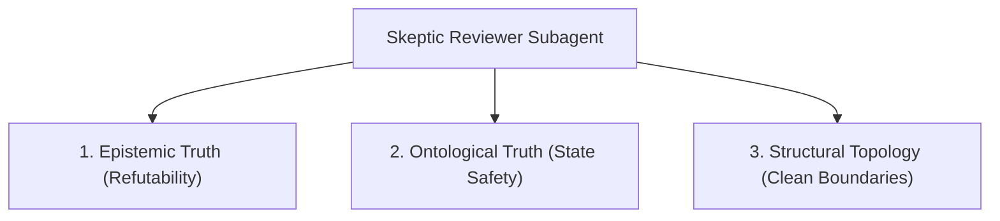

# Code Review (Crux & Intent Gate)

Code Review is an atomic **Semantic & Structural Verification Gate**. It verifies that a code change is **sound in state, resilient in failure, faithful to intent, and compliant with Clean Architecture**, evaluating semantic soundness beyond green test suites.

Operates under **Keel** (load-bearing judgment and boundary seams) and **Coding-Protocol** (read-only evidence state, zero mutation, risk-scaled).

---

## The 3 First-Principles Crux Invariants

A code change $\Delta S$ transitions system state space $S \rightarrow S'$. The reviewer audits three irreducible invariants:



### 1. Epistemic Truth (VDD / Refutability)
- **Refutability Criterion**: Every test must be capable of failing when the behavior is broken. A test that passes regardless of implementation provides 0 bits of information.
- **Red Flag (Paper Tigers)**: Reject tests that mock the unit under test (SUT), assert tautologies (`assert True`), or only assert `mock.called` without asserting return state or side-effect outcomes.
- **Negative Path Invariant**: Critical execution paths must assert refusal and error modes (timeouts, bad payloads, malformed inputs), not only the happy path.

### 2. Ontological Truth (EDD / State Safety & Anti-Laziness)
- **Anti-Laziness Criterion**: The implementation must solve the generalized problem, not just hardcode outputs to satisfy test fixtures.
- **Red Flag (Shortcuts & Swallows)**: Reject hardcoded return values tailored to sample inputs, empty `catch`/`except` blocks, stubbed dummy branches, or unhandled `TODO` markers.
- **State Invariant**: Domain models must make invalid states unrepresentable. Primitive obsession without validation invariants is rejected.
- **Contract Fidelity**: Diff must satisfy the specified BDD intent without behavioral shortcuts or unrequested scope creep.

### 3. Structural Topology (Clean Architecture & Boundary Seams)
- **The Dependency Rule**: Source code dependencies point inward toward domain entities. Core business logic MUST NOT import delivery mechanisms (CLI, HTTP, ORM, frameworks, database drivers).
- **Single Responsibility (SRP)**: Each module has one reason to change. Business logic, serialization/wire format, and transport must remain separated.
- **Encapsulation & Seams**: Cross subsystem boundaries exclusively through explicit interfaces or DTOs. Never expose raw internal database entities or mutable state across boundaries.
- **Design Alignment**: File paths, schemas, interfaces, or CLI flags changed in implementation must match `design.md`.

---

## Operating Protocol (Keel & Coding-Protocol)

1. **Evidence State Only (Coding-Protocol §1-3)**:
   - Reviewer holds **judgment authority** only, never **mutation authority**.
   - Reviewer is strictly forbidden from editing files, fixing bugs, or rewriting code.
2. **Scale by Risk (Coding-Protocol §1)**:
   - **Zero Nitpicks**: Skip all formatting, whitespace, syntax, or styling issues handled by linters.
   - Surface only **`[BLOCKING]`** (contract breach, fake mock, security hole, unhandled failure) and **`[HIGH]`** (architectural leak, design drift, state corruption risk) issues.
3. **Subagent-First Isolation**:
   - Run in a fresh subagent context with only diff, spec, and verification logs.
   - Do NOT inherit the author's conversational rationalizations (eliminates anchoring bias).

---

## Review Process

### Step 1: Ingest Evidence
Retrieve:
- `diff`: `git diff <base>...HEAD` or list of modified files.
- `spec`: BDD scenarios, issue description, or `design.md` (optional).
- `eval_evidence`: Test runner, typecheck, or linter outputs (optional).

Run deterministic pre-scan via `uv run skills/code-review/scripts/review_gate.py scan-diff --diff-file <path>` to flag empty exception handlers, skipped tests, and illegal boundary imports.

### Step 2: Adversarial Crux Audit
Evaluate diff strictly against the 3 Invariants:
- Did the author write real tests, or paper tigers?
- Did the author implement genuine logic, or lazy shortcuts?
- Does the code violate inward dependency direction or leak abstraction seams?
- Has `design.md` drifted from implementation?

### Step 3: Score & Gate Classification
Score the submission on a 1–10 scale:
- **1-4 (Failing/Blocked)**: Broken contract, fake mock pass, empty error swallow, or core architectural inversion.
- **5-7 (Remediate)**: Working happy path, but paper tiger tests, missing failure paths, boundary leaks, or SOT drift.
- **8-10 (Passing)**: Robust, refutable tests, clean dependencies, domain invariants protected, SOT in sync.

**Routing Rules**:
- `Route: continue` $\rightarrow$ Score $\ge 8$, zero `BLOCKING` issues, SOT in sync.
- `Route: remediate` $\rightarrow$ Score $< 8$, or any `BLOCKING`/`HIGH` issues, or SOT drift.
- `Route: blocked` $\rightarrow$ Fundamental architectural flaw or irrecoverable specification mismatch.

---

## Mandatory Response Contract

Format output per `skills/dynamic-workflow-wrapper/references/resp-format.md`:

```markdown
## Summary
<Carmack-style technical evaluation: core invariants verified, architectural fitness, failure mode resiliency, observed tradeoffs>

## Artifacts
- <path/to/review_report.md (or inline report)>

## Route
continue | remediate | blocked
Issues:
- [BLOCKING|HIGH] <brief issue title, ≤10 words>

## Gate Verdict
Score: <1-10>/10 (Quality Gate: 8)
Status: PASS | FAIL

## Crux Invariant Violations
- [BLOCKING|HIGH] <file>:<line>
  - Invariant: [VDD-Refutability | EDD-Intent | Clean-Architecture]
  - Defect: <precise description of what breaks>
  - Impact: <how state corrupts, why test is a paper tiger, or how boundary leaks>
  - Remediation: <concrete actionable fix>

## SOT Sync (Design Alignment)
Status: In Sync | Drift Detected
Details: <amendments required for design.md, if any>
```

---

## References & Tools
- [Crux Rubric & Heuristics](references/crux-rubric.md): Concrete examples of paper tigers, anti-laziness patterns, and Clean Architecture checks.
- Script: `skills/code-review/scripts/review_gate.py` for deterministic diff scanning and verdict validation.
