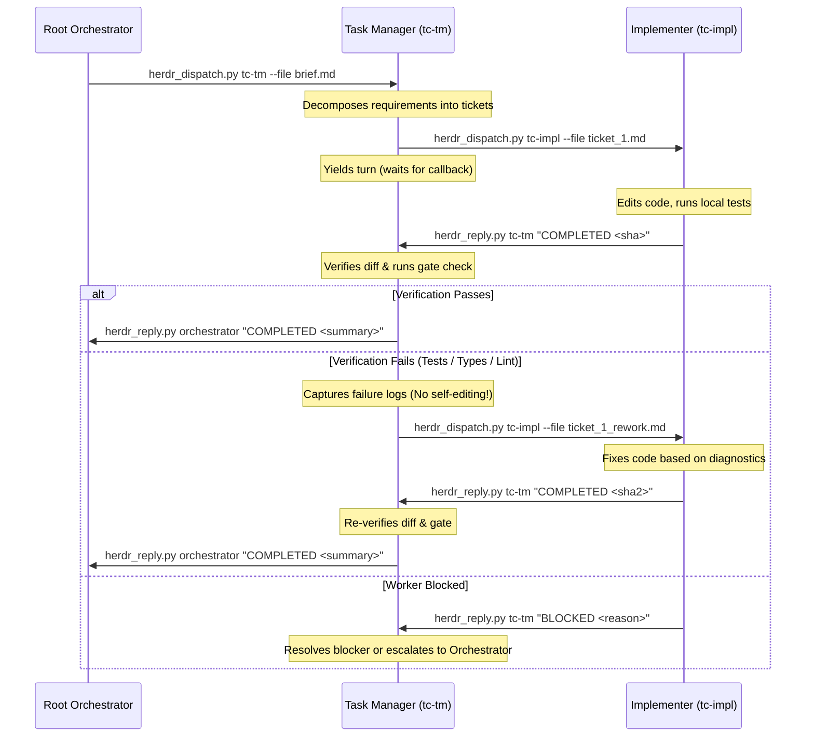

# Hierarchical Lane Coordination (Task Manager <-> Implementer)

Depth for `$SKILL_DIR/SKILL.md`. Architecture and contract protocol for multi-tier Herdr lanes where an in-lane Task Manager coordinates one or more Implementers.

---

## 1. Context & Motivation

When a workflow requires both high-level coordination (triage, planning, verification) and multi-step code execution, the Root Orchestrator provisions an in-lane **Task Manager (TM)** alongside one or more **Implementers (Workers)** in dedicated panes within a shared workspace or tab.

`herdr-prompt` automatically injects sibling workers into the recipient's turn:
```text
Caller: pane=w1:p1 label=orchestrator agent=orchestrator
Herdr: see skill ~/.agents/skills/herdr/SKILL.md — use scripts in ~/.agents/skills/herdr/scripts/ for communication, not bare herdr CLI
Workers: impl-1@w1:p3, impl-2@w1:p4
```

> [!NOTE] Worker Target Parsing
> The `Workers:` header lists workers as `name@pane_id`. The target passed to `herdr_dispatch.py` or `herdr_prompt.py` is the **agent name before the `@` symbol** (`impl-1`, `impl-2`), NOT the full `name@pane_id` string.

### The Anti-Pattern: TM "Hero-Mode"

Without explicit contract boundaries, the TM frequently succumbs to **Hero-Mode**:
- The TM receives the orchestrator's brief.
- Instead of decomposing and delegating, the TM directly invokes its own `edit`, `write`, or `bash` tools.
- The assigned Implementers sit completely idle throughout the session.
- The TM's context window rapidly exhausts on implementation churn and compiler logs, degrading coordination quality and defeating the purpose of multi-agent topology.

### The Ambiguity Trap: Native Subagents vs. Herdr Sibling Workers

A primary driver of Hero-Mode is conflicting instruction phrasing:
- Prompts that specify `"no subagent fan-out"` (intended to forbid platform-native tools like `Agent` or nested background threads) are interpreted by LLMs as a prohibition against **all** delegation—including dispatching to sibling Herdr workers listed in `Workers:`.
- **Rule**: Never use ambiguous phrases like `"no subagent fan-out"`. Distinguish native tool spawning from Herdr worker dispatch.

---

## 2. Separation of Authority

| Role | Authority | Allowed Actions | Strictly Forbidden |
|---|---|---|---|
| **Root Orchestrator** | Global Intent & Topology | • Allocate panes/worktrees<br>• Boot TM and Implementers<br>• Issue brief to TM<br>• Run final release gate | • Direct file editing in worker branches<br>• Bypassing TM to micromanage lane workers |
| **Task Manager (TM)** | In-Lane Coordination & Judgment | • Decompose brief into atomic tickets<br>• Dispatch to workers via `herdr_dispatch.py`<br>• Await worker `herdr_reply.py`<br>• Run verification/audit gates<br>• Dispatch rework tickets on gate failure<br>• Synthesize lane status to caller | • Editing source or test files directly<br>• Running iterative fix loops directly<br>• Ignoring assigned workers in `Workers:` |
| **Implementer (Worker)** | Execution & Mutation | • Read assigned ticket<br>• Edit code and tests to fulfill ticket<br>• Run targeted local checks<br>• Atomic commits<br>• Reply to TM via `herdr_reply.py` | • Expanding scope beyond ticket<br>• Attempting lane-level orchestration<br>• Modifying architectural boundaries unasked |

---

## 3. Canonical Prompt Contracts

### A. Root Orchestrator → TM Brief Contract

The orchestrator brief MUST explicitly define the TM role, prohibit direct editing, and instruct worker dispatch:

```markdown
# TASK: <Feature / Bug Name>

Lane: `<lane-label>` | TM: `<tm-name>` | Workers: `<worker-names>`

## Role & Delegation Mandate
You are the **Task Manager** for this lane. You hold **coordination and judgment authority ONLY**.
- **HARD CONSTRAINT**: Do NOT edit source code, test files, or configuration files directly.
- **DELEGATION**: Decompose requirements into atomic tickets and dispatch them to worker(s) (`<worker-names>`) using:
  `uv run ~/.agents/skills/herdr/scripts/herdr_dispatch.py <worker-name> --file <ticket-path>`
  *(Pass only the worker agent name before `@`, e.g., `impl-1`).*
- Await completion via `herdr_reply.py` callbacks.
- Note: Native platform subagent calls (`Agent` tool) are disabled; use exclusively the Herdr workers listed above.

## Requirements
<Atomic requirements R1, R2, R3...>

## Verification & Reporting
Verify worker diffs against test/lint gates in your pane. On gate failure, dispatch a rework ticket back to the worker—do NOT fix code directly. On completion, reply to caller:
  `uv run ~/.agents/skills/herdr/scripts/herdr_reply.py <caller-name> "<STATUS> <summary>"`
```

### B. TM → Implementer Ticket Contract

`herdr_dispatch.py` automatically injects the `Caller:` header and trailing `herdr_reply.py` command template. The ticket body should specify task scope, constraints, and status triad expectations:

```markdown
# TICKET: <Component / Step Name>

Target files: <paths>
Requirements:
<Exact scope of modification>

Constraints:
- Keep change scoped strictly to this ticket.
- Run local tests: `<command>`

Status contract (reply via herdr_reply helper):
- `COMPLETED <commit-sha> <test-summary>` on clean pass
- `BLOCKED <reason>` if dependencies missing or spec ambiguous
- `REJECTED <reason>` if requirements contradict codebase invariants
```

---

## 4. Execution Lifecycle



1. **Dispatch & Yield**: TM dispatches ticket to worker using `herdr_dispatch.py` (which validates delivery revision). TM stops calling tools and yields turn.
2. **Callback Wakeup**: Worker signals completion via `herdr_reply.py <tm> "<STATUS> ..."`. TM automatically wakes on the incoming message.
3. **Verification & Rework Loop**:
   - TM inspects `git diff` and runs gate commands.
   - **If verification fails**: TM packages the error output into a rework ticket and dispatches it back to the worker (`herdr_dispatch.py <worker> --file rework.md`). **TM must never fix the code directly**—rework belongs to the implementer.
   - **If verification passes**: TM proceeds to the next atomic ticket or reports final completion to the Root Orchestrator.
