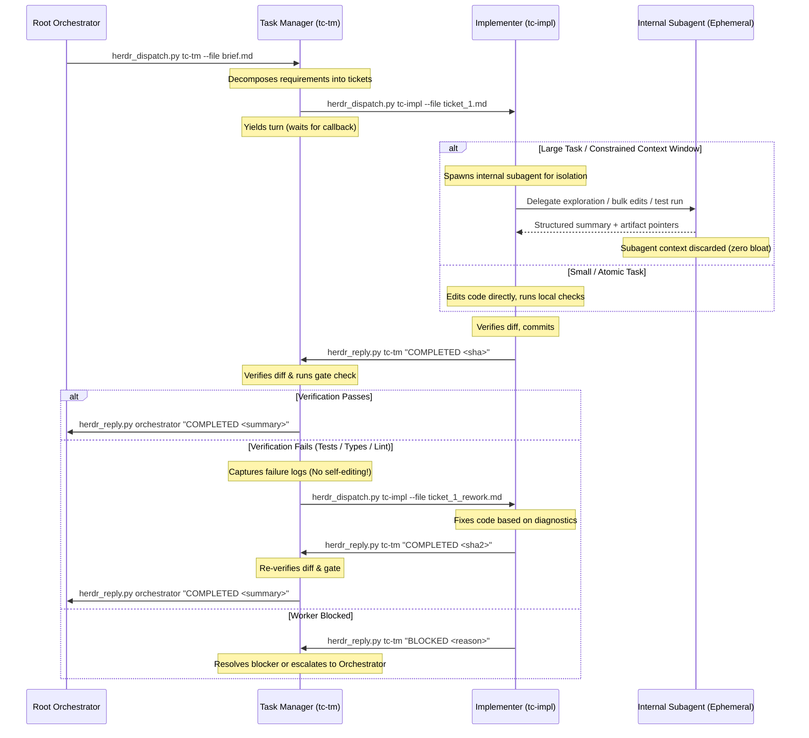

# Hierarchical Lane Coordination (Task Manager <-> Implementer)

Depth for `$SKILL_DIR/SKILL.md`. Architecture and contract protocol for multi-tier Herdr lanes where an in-lane Task Manager coordinates one or more Implementers.

---

## 1. Context & Motivation

When a workflow requires both high-level coordination (triage, planning, verification) and multi-step code execution, the Root Orchestrator provisions an in-lane **Task Manager (TM)** alongside one or more **Implementers (Workers)** in dedicated panes within a shared workspace or tab.

`herdr-prompt` automatically injects sibling workers into the recipient's turn:
```text
Caller: pane=w1:p1 label=orchestrator agent=orchestrator
Herdr: see skill ~/.agents/skills/herdr/SKILL.md — use scripts in ~/.agents/skills/herdr/scripts/ for communication, not bare herdr CLI
Workers: impl-1@w1:p3, impl-2@w1:p4
```

> [!NOTE] Worker Target Parsing
> The `Workers:` header lists workers as `name@pane_id`. The target passed to `herdr_dispatch.py` or `herdr_prompt.py` is the **agent name before the `@` symbol** (`impl-1`, `impl-2`), NOT the full `name@pane_id` string.

### The Anti-Pattern: TM "Hero-Mode"

Without explicit contract boundaries, the TM frequently succumbs to **Hero-Mode**:
- The TM receives the orchestrator's brief.
- Instead of decomposing and delegating, the TM directly invokes its own `edit`, `write`, or `bash` tools.
- The assigned Implementers sit completely idle throughout the session.
- The TM's context window rapidly exhausts on implementation churn and compiler logs, degrading coordination quality and defeating the purpose of multi-agent topology.

### The Implementer Context Pressure Trap

Implementers operate under maximum context pressure (code reading, drafting, syntax diagnostics, test execution). When an Implementer is assigned a large/complex task or operates under a constrained context window (e.g., small context budget, or massive multi-file repos):
- Broad codebase greps, massive file reads, and verbose compiler/test traces rapidly cause **context bloating**.
- Frequent **context compaction / truncation degradation** kicks in: the model discards earlier turn context, losing ticket constraints, architectural invariants, and acceptance criteria.
- Reasoning quality degrades: the agent hallucinates file states, produces half-finished edits, or drops required tool arguments.

### Two-Tier Delegation Architecture: Lane Coordination vs. Worker-Internal Subagents

To solve both TM Hero-Mode and Worker Context Bloating, enforce a clean two-tier delegation architecture:

1. **Tier 1: Lane-Level Coordination (Herdr Inter-Pane)**
   - **Topology**: Root Orchestrator ↔ Task Manager ↔ Implementers across dedicated Herdr panes.
   - **Protocol**: Event-driven via `herdr_dispatch.py` and `herdr_reply.py`.
   - **Scope**: Lane planning, worktree lifecycle, ticket dispatch, verification gates, status triad (`COMPLETED`, `BLOCKED`, `REJECTED`).
   - **Rule**: Never use ambiguous phrases like `"no subagent fan-out"`. Clarify whether a restriction targets lane workers or native subagents.

2. **Tier 2: Worker-Internal Subagent Delegation (Context Isolation)**
   - **Topology**: Implementer pane ↔ Ephemeral platform subagents (`Agent`, `invoke_subagent`, scratch tasks).
   - **Protocol**: Tool-level invocation with pointer-based handoffs (file paths, diff summaries).
   - **Scope**: Heavy codebase exploration, bulk multi-file edits, and verbose test runs isolated to disposable subagent contexts.
   - **Boundary Invariant**: Internal subagents are strictly worker-private. They NEVER invoke Herdr CLI commands, NEVER manage panes, and NEVER call `herdr_reply.py`. The Implementer remains the sole owner of the ticket and the single point of contact for the TM.

---

## 2. Separation of Authority

| Role | Authority | Allowed Actions | Strictly Forbidden |
|---|---|---|---|
| **Root Orchestrator** | Global Intent & Topology | • Allocate panes/worktrees<br>• Boot TM and Implementers<br>• Issue brief to TM<br>• Run final release gate | • Direct file editing in worker branches<br>• Bypassing TM to micromanage lane workers |
| **Task Manager (TM)** | In-Lane Coordination & Judgment | • Decompose brief into atomic tickets<br>• Dispatch to workers via `herdr_dispatch.py`<br>• Await worker `herdr_reply.py`<br>• Run verification/audit gates<br>• Dispatch rework tickets on gate failure<br>• Synthesize lane status to caller | • Editing source or test files directly<br>• Running iterative fix loops directly<br>• Ignoring assigned workers in `Workers:`<br>• Spawning uncoordinated background panes |
| **Implementer (Worker)** | Execution & Mutation | • Read assigned ticket<br>• Spawn internal subagents for context isolation (research, bulk edits, test triage)<br>• Edit code and tests to fulfill ticket<br>• Run targeted local checks<br>• Atomic commits<br>• Aggregate results and reply to TM via `herdr_reply.py` | • Expanding scope beyond ticket<br>• Attempting lane-level orchestration (dispatching to other Herdr panes)<br>• Modifying architectural boundaries unasked<br>• Allowing internal subagents to call Herdr CLI or `herdr_reply.py` |
| **Worker Subagent (Internal)** | Isolated Subtask Execution | • Read-only codebase exploration<br>• Scoped file editing/refactoring<br>• Isolated test execution and log filtering<br>• Return structured result/pointers to parent worker | • Invoking Herdr CLI / scripts (`herdr_dispatch.py`, `herdr_reply.py`)<br>• Bypassing parent worker to message TM or Orchestrator<br>• Spawning nested subagents (no agent-ception) |

---

## 3. Canonical Prompt Contracts

### A. Root Orchestrator → TM Brief Contract

The orchestrator brief MUST explicitly define the TM role, prohibit direct editing, and instruct worker dispatch:

```markdown
# TASK: <Feature / Bug Name>

Lane: `<lane-label>` | TM: `<tm-name>` | Workers: `<worker-names>`

## Role & Delegation Mandate
You are the **Task Manager** for this lane. You hold **coordination and judgment authority ONLY**.
- **HARD CONSTRAINT**: Do NOT edit source code, test files, or configuration files directly.
- **DELEGATION**: Decompose requirements into atomic tickets and dispatch them to worker(s) (`<worker-names>`) using:
  `uv run ~/.agents/skills/herdr/scripts/herdr_dispatch.py <worker-name> --file <ticket-path>`
  *(Pass only the worker agent name before `@`, e.g., `impl-1`).*
- Await completion via `herdr_reply.py` callbacks.
- Note: Native platform subagent calls (`Agent` tool) are disabled for lane coordination; use exclusively the Herdr workers listed above.

## Requirements
<Atomic requirements R1, R2, R3...>

## Verification & Reporting
Verify worker diffs against test/lint gates in your pane. On gate failure, dispatch a rework ticket back to the worker—do NOT fix code directly. On completion, reply to caller:
  `uv run ~/.agents/skills/herdr/scripts/herdr_reply.py <caller-name> "<STATUS> <summary>"`
```

### B. TM → Implementer Ticket Contract

`herdr_dispatch.py` automatically injects the `Caller:` header and trailing `herdr_reply.py` command template. The ticket body should specify task scope, constraints, context isolation expectations, and status triad expectations:

```markdown
# TICKET: <Component / Step Name>

Target files: <paths>
Requirements:
<Exact scope of modification>

Constraints:
- Keep change scoped strictly to this ticket.
- Run local tests: `<command>`

Execution Strategy (Context Isolation):
- If this task requires broad exploration, multi-file refactoring, or verbose test debugging: spawn internal subagents (`Agent` / `invoke_subagent`) to isolate heavy observations.
- Keep the worker pane context lean: ingest only summaries and artifact paths from subagents.
- Do NOT let subagents call Herdr scripts; aggregate results in this worker pane.

Status contract (reply via herdr_reply helper):
- `COMPLETED <commit-sha> <test-summary>` on clean pass
- `BLOCKED <reason>` if dependencies missing or spec ambiguous
- `REJECTED <reason>` if requirements contradict codebase invariants
```

---

## 4. Execution Lifecycle



1. **Dispatch & Yield**: TM dispatches ticket to worker using `herdr_dispatch.py` (which validates delivery revision). TM stops calling tools and yields turn.
2. **Context-Isolated Execution**:
   - For small/isolated tasks, the Implementer executes directly in its pane.
   - For large tasks or constrained context windows, the Implementer delegates exploration, editing, or test debugging to internal ephemeral subagents.
3. **Callback Wakeup**: Worker aggregates results, commits changes, and signals completion via `herdr_reply.py <tm> "<STATUS> ..."`. TM automatically wakes on the incoming message.
4. **Verification & Rework Loop**:
   - TM inspects `git diff` and runs gate commands.
   - **If verification fails**: TM packages the error output into a rework ticket and dispatches it back to the worker (`herdr_dispatch.py <worker> --file rework.md`). **TM must never fix the code directly**—rework belongs to the implementer.
   - **If verification passes**: TM proceeds to the next atomic ticket or reports final completion to the Root Orchestrator.

---

## 5. Implementer Context Isolation via Subagents

### Why Subagents for Implementers?

Implementers face acute **context budget asymmetry**: they bear the brunt of mechanical exploration, syntax errors, repetitive edits, and verbose test logs. When an implementer handles a large task within a limited context window:
- **Search & Discovery Bloat**: Grepping large repos or reading multiple files consumes tens of thousands of tokens before writing a single line of code.
- **Log Pollution**: Verbose build output, typecheck diagnostics, and test failure dumps flood the prompt buffer.
- **Compaction Degradation**: Once the context threshold is reached, automated summarization/compaction occurs. Compaction discards ticket constraints, architectural invariants, and acceptance criteria, causing subtle bugs, regressions, and lost execution state.

### Three Delegation Patterns for Implementers

| Pattern | Trigger Condition | Delegation Action | Return Contract |
|---|---|---|---|
| **Scout / Research Subagent** | Unfamiliar codebase or multi-file symbol dependency | Launch read-only subagent to locate symbols, inspect callers, and list exact file paths. | File paths, line ranges, and architectural notes. Zero file dumps into parent context. |
| **Worker / Editor Subagent** | Repetitive multi-file changes or deep refactoring | Launch editing subagent with strict file-list scope and target diff requirements. | Diff summary and modified file paths. Parent verifies `git diff`. |
| **Test Runner / Triage Subagent** | Test suite output exceeds 50 lines or complex failure traces | Launch subagent to run tests, isolate failures, and extract relevant error stacks. | Carmack-style failure summary (failing test, assertion line, minimal error cause). |

### Coordination Protocols & Invariants

```text
┌────────────────────────────────────────────────────────┐
│                   Herdr Lane (Tier 1)                  │
│                                                        │
│  [Task Manager] ── herdr_dispatch.py ──► [Implementer] │
│        ▲                                      │        │
│        └──────── herdr_reply.py ──────────────┤        │
└───────────────────────────────────────────────┼────────┘
                                                │ (Worker-Internal Tier 2)
                                                ▼
                                    ┌───────────────────────┐
                                    │  Internal Subagents   │
                                    │  - Scout / Research   │
                                    │  - Bulk Refactor      │
                                    │  - Test Log Triage    │
                                    │  (Ephemeral contexts) │
                                    └───────────────────────┘
```

1. **Pointer-Based State Exchange**:
   - The Implementer never inlines large code blobs into subagent prompts.
   - Pass file paths, ticket paths, and command lines.
   - Subagents write changes directly to disk or return concise summaries with paths.
2. **Ephemeral Context Lifecycle**:
   - Subagents are single-task and disposable.
   - When a subagent finishes, its heavy exploration context is discarded. The Implementer pane retains only the crisp summary and artifact pointers, keeping its context clean and avoiding compaction across long multi-ticket runs.
3. **Strict Lane Isolation (The Iron Curtain)**:
   - **Subagents must NEVER interact with Herdr**: They do not run `herdr_reply.py`, `herdr_dispatch.py`, `herdr_overview.py`, or any Herdr CLI commands.
   - **Single Interface**: All external lane status reporting is owned exclusively by the Implementer pane.
   - **No Agent-ception**: Internal subagents must not spawn further nested subagents.
