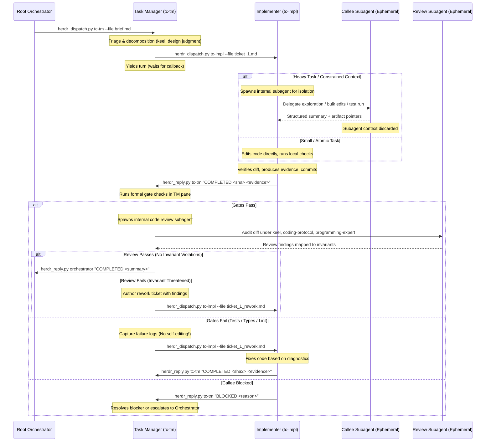

# Hierarchical Lane Coordination (Task Manager <-> Implementer)

Depth for `$SKILL_DIR/SKILL.md`. Architecture, role boundaries, and contract protocols for multi-tier Herdr lanes where an in-lane Task Manager coordinates one or more Implementers (#153, #156, #166, #167, #172).

> [!IMPORTANT] Method Constraint
> Always use harness scripts in `$SKILL_DIR/scripts/` (e.g. `herdr_dispatch.py`, `herdr_reply.py`, `herdr_prompt.py`, `herdr_overview.py`), NOT bare `herdr` CLI commands, for lane coordination, task dispatch, and completion replies.

---

## 1. Context & Motivation

When a workflow requires both high-level coordination (triage, planning, verification, review) and focused code execution, the Root Orchestrator provisions an in-lane **Task Manager (TM)** alongside one or more **Implementers (Callees)** in dedicated panes within a shared workspace or tab.

`herdr-prompt` and `herdr-dispatch` automatically inject caller context (including the **Resumption Triple**: `kind + session + cwd`), the Herdr skill notice, and sibling callees into the recipient's turn:
```text
[2026-10-05T06:19:12.983Z]
tab: w1:t1
  pane: w1:p1
  label: orchestrator
  agent: orchestrator
kind: pi
  session: /path/to/session.jsonl
  resume: "pi --resume /path/to/session.jsonl"
cwd: /Users/zhengxk/workspace
Herdr: see skill ~/.agents/skills/herdr/SKILL.md — use scripts in ~/.agents/skills/herdr/scripts/ for communication, not bare herdr CLI
Group Members: orchestrator@w1:p1, impl-1@w1:p3, impl-2@w1:p4

Callee: impl-1
```

> [!IMPORTANT] Name Every Pane Immediately
> Unlabeled panes (`null`) cause blind spots in `herdr-overview` and break automated reply routing. Name each pane with meaningful text matching its role (`orchestrator`, `task-manager`, `impl-auth`, `reviewer`) using `herdr-pane --label` or `herdr-label`.

> [!NOTE] Callee Target Parsing
> The `Group Members:` header lists callees as `name@pane_id`. The target passed to `herdr_dispatch.py` or `herdr_prompt.py` is the **agent name before the `@` symbol** (`impl-1`, `impl-2`), NOT the full `name@pane_id` string.

### Core Anti-Patterns & Their Tells

Without explicit, enforceable boundaries, multi-agent lanes degrade into three common failure modes:

| Anti-Pattern | Definition | The Tell That Exposes It | Failure Mode & Impact |
|---|---|---|---|
| **Anchored Brief** | The Orchestrator exceeds its intent/constraints scope by performing deep code reconnaissance and baking line-level implementation maps or design pre-decisions into the TM brief (#172). | The brief specifies exact line numbers, private function names, AST/parser instructions, internal state table indices, or pre-decided algorithms/precedence orders. | Pre-empts TM triage, strips TM of architectural ownership, and forces the TM into a pass-through router. |
| **Router TM** | The TM fails to exercise decomposition, scoping, or design judgment, acting merely as a pass-through relay that forwards the brief verbatim or slices it mechanically (#172). | Callee tickets are copy-pasted verbatim from the brief; TM makes zero exploratory/triage tool calls before dispatching; tickets lack independent scoping, evidence criteria, or architecture invariant checks. | Callees receive un-scoped or over-anchored tickets; edge cases and module invariants are ignored; verification becomes a superficial check of whatever test was named in the brief. |
| **Hero-Mode TM** | The TM receives the brief and, instead of delegating to assigned callees, directly invokes file-editing tools (`edit`, `write`, `bash`) to implement the changes itself (#153). | Assigned callees in `Group Members:` remain completely idle (revision 0 or no dispatches); TM tool calls are dominated by file edits and compile/fix loops; TM context window rapidly exhausts. | Multi-agent topology is bypassed; lane loses division of labor; TM suffers context compaction degradation, losing ticket constraints and architectural invariants. |

### Two-Tier Delegation Architecture: Lane Coordination vs. Role-Internal Subagents

To resolve all three anti-patterns and manage context pressure asymmetry, enforce a clean two-tier delegation architecture:

> [!IMPORTANT] Subagent-First Execution Mandate
> Subagent-First Execution is a **Universal Mandate across all coding agents**, regardless of underlying kind or engine (`pi`, `claude`, `agy`, `cursor`, `cline`, `codex`, `gemini`, etc.). All coding agents in lane coordination (both Task Managers and Implementers) **MUST** use subagents for heavy tasks:
> - **Implementers**: MUST delegate deep codebase exploration (Scout), multi-file code editing / refactoring (Editor), and test failure log triage (Test Runner) to ephemeral subagents. Direct execution of heavy work in the callee host pane exhausts context windows, triggers severe compaction degradation, and leads to instruction amnesia.
> - **Task Managers**: MUST delegate crux adversarial code review under `keel`, `coding-protocol`, and `programming-expert` to an internal review subagent. Reviewing massive diffs directly in the TM pane blinds the TM to lane invariants and architectural oversight.

1. **Tier 1: Lane-Level Coordination (Herdr Inter-Pane)**
   - **Topology**: Root Orchestrator ↔ Task Manager ↔ Implementers across dedicated Herdr panes.
   - **Protocol**: Event-driven via `herdr_dispatch.py` and `herdr_reply.py` governed by Task Leases and Token Observability.
   - **Scope**: In-lane execution inside the lane's pre-provisioned `$WORKTREE_PATH`: lane planning, ticket dispatch, verification gates, code review verdicts, status triad (`COMPLETED`, `BLOCKED`, `REJECTED`).
   - **Rule**: Even single-ticket lanes go `Orch → TM → Impl`: the orchestrator pre-provisions the lane worktree and topology but never dispatches callee tickets directly (#166). TM and Implementer run natively inside `$WORKTREE_PATH` from turn zero; neither creates ad-hoc worktrees or nested directories.

2. **Tier 2: Role-Internal Subagent Delegation (Context Isolation)**
   - **Topology**: Host pane ↔ Ephemeral platform subagents (`Agent`, `invoke_subagent`, scratch tasks).
   - **Scope for Implementer**: Heavy codebase exploration (Scout), bulk multi-file edits (Editor), and verbose test runs (Test Runner) isolated to disposable subagent contexts (#156).
   - **Scope for Task Manager**: Adversarial crux code review (`keel`, `coding-protocol`, `programming-expert`) delegated to an internal review subagent to prevent TM context pollution from reading massive diffs and to guarantee an objective review verdict (#166, #172).
   - **Boundary Invariant (The Iron Curtain)**: Internal subagents are strictly private to the hosting pane. They **NEVER** invoke Herdr CLI commands, **NEVER** manage panes, and **NEVER** call `herdr_reply.py`. The hosting agent remains the sole owner of the role contract and the single point of contact for external lane communication.

---

## 2. Role Boundaries & Authority Contracts

### A. Root Orchestrator Contract

The Root Orchestrator owns the problem definition, global constraints, topology provisioning, and final delivery verification. It does not dictate implementation mechanics or pre-empt in-lane design decisions.

- **Bound Architectural Skills**:
  - `keel`: Identify affected module boundaries, seams, and cross-cutting invariants at a high level without probing private internals.
  - `coding-protocol`: Frame the acceptance and verification contract—specify what observable empirical evidence proves completion, without prescribing line-level code changes.
- **Reconnaissance Budget (Go/No-Go Sizing Only)**:
  - **Allowed Sizing Scope**:
    1. *Seam inventory*: How many module boundaries or public interfaces are affected.
    2. *Dependency impact*: Does the change introduce new external dependencies or build tools.
    3. *Existing test coverage*: Do regression test suites or fixtures exist for the affected surface, or must a new harness be bootstrapped.
    4. *Topology sizing*: Sizing magnitude (S/M/L) to allocate sufficient implementer panes.
  - **Forbidden Internals**:
    1. Reading private functions, helper utilities, or internal state tables to craft an implementation map.
    2. Specifying line numbers, exact read sites, or specific statement edits.
    3. Pre-deciding design choices (precedence order, algorithm selection, lockfile preferences, data structures).
    4. Slicing tasks into code-granular sub-steps for the TM.

#### Worked Reconnaissance Examples

> [!TIP] Positive Example: Allowed Orchestrator Sizing Output
> ```markdown
> ## Sizing & Boundaries
> - Seams touched: 1 seam between the CLI options parser (`src/cli/args.py`) and config loader (`src/config/loader.py`).
> - Dependencies: Standard library only; no new external packages.
> - Test baseline: Pytest suite exists for loader (`tests/test_loader.py`); CLI flags require new regression coverage.
> - Sizing: Small (S) — single-ticket lane with 1 implementer.
> ```

> [!WARNING] Negative Example: Forbidden Orchestrator Over-Reach (Anchored Brief)
> ```markdown
> ## Implementation Plan (FORBIDDEN)
> - In `clients/tool-agreement.ts` at line 42, modify `resolveAgreement()` to read from `bucketTable` at index 2.
> - Use lockfile precedence Yarn > Pnpm > Npm; tolerate pnpm-v6 by checking `packageManager` in package.json.
> - Keep `test_agreement` green by updating the mock at line 88 to return `{ status: 'ok' }`.
> ```

- **Explicit Allow List**:
  - Confirm role-to-agent mapping (role, agent kind, provider, model) with user before lane provisioning (#159).
  - Pre-allocate one isolated worktree per lane with `herdr_worktree.py allocate`, then allocate panes and tabs for lane topology and launch them inside it with `--cwd "$WORKTREE_PATH"`.
  - Name Every Pane Immediately: Unlabeled panes (`null`) cause blind spots in `herdr-overview` and break automated reply routing. Name each pane with meaningful text matching its role (`orchestrator`, `task-manager`, `impl-auth`, `reviewer`) using `herdr-pane --label` or `herdr-label`.
  - Boot TM and Implementers with verified bootstrap flags (or allocate panes and delegate boot verification to TM per #167).
  - Issue brief to TM specifying intent, goal, constraints, acceptance criteria, verification contract, and sizing budget.
  - Re-brief or escalate when TM reports `BLOCKED` or `REJECTED`.
  - Run final release/audit gate on lane completion.
- **Explicit Forbid List**:
  - Reading implementation internals to build an implementation plan.
  - Pre-deciding design trade-offs belonging to the TM.
  - Writing code-granular or line-level requirements in the brief.
  - Editing source, test, or config files directly.
  - Bypassing TM to dispatch tickets directly to lane callees (#166).

---

### B. Task Manager (TM) Contract

The Task Manager owns in-lane triage, decomposition, scope boundaries, design judgment, ticket authoring, verification gate execution, and code review verdicts.

- **Bound Architectural Skills**:
  - `keel`: Discover, judge, and govern architectural seams, module boundaries, and domain state invariants. Ensure callee changes do not introduce structural drift, hidden coupling, or leaky abstractions.
  - `coding-protocol`: Risk-scaled execution, evidence standards, and explicit verification contracts (`[action] -> [check]`). Demand concrete, reproducible test evidence from callees.
  - `programming-expert`: Language-level correctness, idiomatic implementation, error handling, type soundness, and deep design (narrow interfaces, absorbing complexity, rejecting classitis). Distinguish permitted design deepening from harmful scope creep.
- **Mandatory Review Lens**:
  - Every review finding MUST be explicitly mapped to the invariant it threatens.
  - Green gate passes (tests, linter) are necessary but NEVER sufficient; an explicit review verdict is required for every ticket (#166).
- **Code Review via Internal Subagents**:
  - The TM MUST use internal ephemeral subagents for code review.
  - Spawns an internal subagent (e.g. `Agent` / `invoke_subagent`) equipped with `keel`, `coding-protocol`, and `programming-expert` to review the callee diff.
  - **Rationale**: Keeps the TM's context window pristine, eliminates reviewer fatigue, prevents context compaction degradation across long multi-ticket runs, and ensures an adversarial, objective review.
  - Subagent returns structured review findings with invariant mapping; TM renders the formal review verdict.
- **Explicit Allow List**:
  - Decompose orchestrator brief into atomic, single-intent tickets.
  - Exercise independent design judgment (data structures, algorithms, internal interfaces, refactoring depth).
  - Author tickets specifying target files, scope boundaries, constraints, and explicit test/evidence requirements.
  - Dispatch tickets to callees via `herdr_dispatch.py` and await `herdr_reply.py`.
  - Run verification gates (tests, linter, typecheck) in the TM pane against callee diffs, executed natively inside the lane's `$WORKTREE_PATH`.
  - Spawn internal subagents for code review under `keel`, `coding-protocol`, and `programming-expert`.
  - Issue review verdicts (`PASS`, `REWORK`, `REJECT`) mapping findings to threatened invariants.
  - Dispatch rework tickets on gate failures or review findings with targeted diagnostics.
  - Synthesize lane status to orchestrator via `herdr_reply.py`.
- **Explicit Forbid List**:
  - Editing source, test, or config files directly ("Hero-Mode TM").
  - Running iterative fix loops directly in the TM pane.
  - Acting as a pass-through router ("Router TM") that forwards brief requirements without decomposition, scoping, or design judgment.
  - Accepting green gates as a substitute for code review without an explicit review verdict (#166).
  - Flagging cohesive internal refactoring (design deepening) as scope creep when it strengthens invariants without expanding public surfaces.
  - Ignoring assigned callees in `Group Members:`.
  - Allowing internal subagents to invoke Herdr CLI or `herdr_reply.py`.

---

### C. Implementer (Callee) Contract

The Implementer owns execution, mutation, and concrete evidence production. It translates assigned ticket requirements into atomic, verified commits.

- **Bound Architectural Skills**:
  - `keel`: Respect structural boundaries and module seams. Adhere to domain invariants and interface contracts established by the ticket.
  - `coding-protocol`: Risk-scaled execution, red-first / replayable test evidence, minimal diffs, atomic commits. Every changed line must trace directly to ticket requirements.
  - `programming-expert`: Language-level idiomatic implementation, strict typing, rigorous error handling, resource cleanup (RAII), and robust test coverage.
- **Concrete Evidence Requirement**:
  - The implementer must produce concrete, replayable evidence (red-then-green test runs, linter passes, diff summaries, commit SHAs), NOT a mere textual assertion of quality ("tests pass").
- **Context Isolation via Internal Subagents**:
  - For large or complex tasks, the implementer delegates heavy search, bulk editing, or verbose test triage to ephemeral internal subagents to prevent context bloating and compaction degradation (#156).
- **Explicit Allow List**:
  - Read assigned ticket requirements and constraints.
  - Spawn internal subagents for context isolation (Scout, Editor, Test Runner).
  - Edit source code and tests to fulfill ticket requirements.
  - Run local test, lint, and typecheck checks.
  - Produce concrete execution evidence (reproducibility traces, red-then-green logs).
  - Make atomic commits matching ticket scope.
  - Aggregate results and reply to TM via `herdr_reply.py`.
- **Explicit Forbid List**:
  - Expanding scope beyond ticket boundaries (unmandated public APIs, config mutations).
  - Attempting lane-level orchestration (dispatching to other Herdr panes or agents).
  - Modifying architectural boundaries or public seams unasked.
  - Producing assertions of quality without concrete replayable evidence.
  - Allowing internal subagents to invoke Herdr CLI or `herdr_reply.py`.

---

## 3. Artifact Ownership Matrix (Boundary Table)

Each artifact in the lane coordination lifecycle has **exactly one author role**:

| Artifact | Author Role | Consumer Role | Purpose & Binding Standard |
|---|---|---|---|
| **Brief** | Root Orchestrator | Task Manager | Global intent, constraints, acceptance criteria, verification contract, and go/no-go sizing budget. Free of line-level internals. |
| **Ticket** | Task Manager | Implementer | Decomposed task specification with bounded scope, test criteria, and evidence expectations. |
| **Diff** | Implementer | Task Manager | Source, test, and config mutations fulfilling ticket requirements. Accompanied by atomic commit. |
| **Gate Output** | Task Manager | Task Manager / Orchestrator | Verbatim logs from formal test, lint, and typecheck suites executed in the TM pane against the callee diff. |
| **Review Verdict** | Task Manager | Task Manager / Implementer | Semantic evaluation under `keel`, `coding-protocol`, and `programming-expert` (authored via TM review subagent), mapping every finding to the invariant it threatens. |
| **Completion Callback** | Task Manager | Root Orchestrator | Final lane delivery report (`COMPLETED`, `BLOCKED`, `REJECTED`) containing branch name, commit SHAs, gate output summary, and review findings. |
| *(Callee Callback)* | Implementer | Task Manager | Intra-lane progress report (`COMPLETED`, `BLOCKED`, `REJECTED`) containing commit SHA and concrete test evidence. |

---

## 4. Canonical Prompt Contracts

### The Injected Context Header & The Resumption Triple

Every dispatch initiated via `herdr_dispatch.py` or `herdr_prompt.py` automatically injects a structured header at turn zero before the ticket payload. The header captures lane topology and the **Resumption Triple** (`kind + session + cwd`), ensuring full context fidelity, debugging observability, and seamless session resumption:

```text
[2026-10-05T06:19:12.983Z]
tab: w1:t1
  pane: w1:p1
  label: orchestrator
  agent: orchestrator
kind: pi
  session: /path/to/session.jsonl
  resume: "pi --resume /path/to/session.jsonl"
cwd: /Users/zhengxk/workspace
Herdr: see skill ~/.agents/skills/herdr/SKILL.md — use scripts in ~/.agents/skills/herdr/scripts/ for communication, not bare herdr CLI
Group Members: orchestrator@w1:p1, impl-1@w1:p3, impl-2@w1:p4

Callee: impl-1
```

- **Resumption Triple (`kind + session + cwd`)**: Guarantees that any participant, watchdog, or human operator can re-enter or resume the exact calling agent session in the identical working directory without amnesia.
- **Topological Coordinates (`pane`, `label`, `tab`, `agent`)**: Identifies physical and logical coordinates in Herdr.
- **`Group Members:` List**: Injects assigned implementers as `name@pane_id`. The target passed to `herdr_dispatch.py` or `herdr_prompt.py` is the **agent name before the `@` symbol** (`impl-1`, `impl-2`).

---

### A. Root Orchestrator → TM Brief Contract

The orchestrator brief defines the problem, boundary constraints, acceptance criteria, verification contract, and sizing budget. It does not dictate implementation internals:

```markdown
# TASK: <Feature / Bug Name>

Lane: `<lane-label>` | TM: `<tm-name>` | Callees: `<callee-names>`
Role Assignment: TM=`<kind>` (`<provider>/<model>`), Callees=`<kind>` (`<provider>/<model>`) [Bootstrap: `<flags>`]

## Role & Delegation Mandate
You are the **Task Manager** for this lane. You hold **coordination, design judgment, and review authority ONLY**.
- **HARD CONSTRAINT**: Do NOT edit source code, test files, or configuration files directly.
- **DELEGATION**: Decompose requirements into atomic tickets and dispatch them to callee(s) (`<callee-names>`) using:
  `uv run ~/.agents/skills/herdr/scripts/herdr_dispatch.py <callee-name> --file <ticket-path>`
  *(Pass only the callee agent name before `@`, e.g., `impl-1`).*
- Await completion via `herdr_reply.py` callbacks.
- **CODE REVIEW MANDATE**: On receiving callee completion, run verification gates AND spawn an internal subagent to conduct an adversarial crux code review under `keel`, `coding-protocol`, and `programming-expert`.
- Note: Native platform subagent calls (`Agent` tool) in your pane are reserved for code review and triage; use exclusively the Herdr callees listed above for code mutation.

## Intent (IDD) & Goals (GDD)
- **Problem**: <High-level deficiency, friction, or behavioral regression in current world state>
- **Proposed Outcome**: <Observable change in behavior or capability once resolved>
- **Non-Negotiable Constraints**: <Backwards compatibility, community rules, performance ceilings, forbidden patterns>

## Acceptance Criteria (BDD)
<Observable behavioral criteria (Given/When/Then scenarios)>

## Verification Contract (EDD)
<Which command proves completion, expected gate results, and who verifies what>

## Sizing & Seams (Reconnaissance Budget)
- Seams touched: <Module boundaries affected>
- Dependencies: <External package additions or modifications>
- Test baseline: <Existing test fixtures vs required new coverage>
- Sizing: <S/M/L estimate and callee topology suggestion>

## Reporting
On gate pass and review approval, reply to caller using the Final Reply Template:
  `uv run ~/.agents/skills/herdr/scripts/herdr_reply.py <caller-name> "<STATUS> <summary>"`
```

---

### B. Synthesized IDD/GDD Dispatch Template (TM → Implementer Ticket Contract)

Every ticket dispatched to a callee pairs upstream teleological purpose (**IDD**) with downstream verifiable targets (**GDD/EDD**). This dual pairing prevents both specification gaming (Goodhart's Law) and semantic drift:

```markdown
# TICKET / BRIEF: <ID> — <Title>

Target files / Seams: <paths or boundary definitions>

## 1. Intent (IDD)
- **Problem**: <Concrete deficiency, friction, or behavioral regression in current world state>
- **Proposed Outcome**: <Observable change in behavior, capability, or invariant once resolved>
- **Non-Negotiable Constraints**: <Invariants, boundary rules, banned patterns, backwards compatibility>

## 2. Verification Contract (GDD/EDD)
- **Check Command**: `<deterministic command proving environmental truth, e.g. uv run pytest tests/...>`
- **Required Evidence**: `<concrete proof required: red-then-green test logs, exit code 0, commit SHA>`

## 3. Execution Strategy (Subagent-First Mandate)
- Delegate heavy codebase exploration (Scout), multi-file code editing / refactoring (Editor), and test failure log triage (Test Runner) to ephemeral platform subagents.
- Keep the callee host pane context lean: ingest only summaries, diffs, and artifact paths from subagents.
- **The Iron Curtain**: Never let subagents call Herdr CLI commands or scripts (`herdr_reply.py`, `herdr_dispatch.py`). Aggregate all results in this host pane.

On completion, reply to the caller in one message using the herdr helper script:
  uv run ~/.agents/skills/herdr/scripts/herdr_reply.py <caller-name> --file <reply-payload.md>
  # (Or inline: uv run ~/.agents/skills/herdr/scripts/herdr_reply.py <caller-name> "<PAYLOAD>")
```

---

### C. The Final Reply Template (Aligned with `resp-format.md`)

All completion replies delivered via `herdr_reply.py` adhere strictly to the dual-mode response format defined in `skills/dynamic-workflow-wrapper/references/resp-format.md` and `skills/ai-engineering-expert/references/resp-format.md`:

```markdown
Sender: pane=<pane-id> label=<label> agent=<agent> kind=<kind> session=<session-path> cwd=<cwd> resume="<resume-cmd>"

COMPLETED <commit-sha>
<!-- Or: BLOCKED <concise-reason> | REJECTED <invariant-violation-reason> -->

## Summary
<Carmack-style delivery: technical approach, architectural rationale, state tradeoffs, ≤100 words>

## Artifacts
- <absolute/path/to/file> (<diff | spec | report | eval | pr>)

## Evidence
- <check_name>: PASS | FAIL (`<command>`) [tail ≤20 lines on failure]

## Route
continue | remediate | blocked

## Issues
- [P1|P2|P3] <file>:<line> — <Invariant / Contract>: <Defect description>. Remediation: <Concrete fix>
<!-- Or: None -->

## Suggestions (Optional)
- [<Category>] <observation>. Workaround: <workaround>. Suggestion: <suggestion>
```

#### Status Triad & Routing Semantics
- **Status Triad**:
  - `COMPLETED <commit-sha>`: All requirements met, all deterministic verification checks green, clean commit created.
  - `BLOCKED <reason>`: Unresolvable environmental blocker, missing dependencies, or contradictory specification.
  - `REJECTED <reason>`: Requested change violates codebase invariants, architectural boundaries, or security constraints.
- **Route**:
  - `continue`: 0 P1/P2 issues AND all verification checks green. Ready to proceed or merge.
  - `remediate`: P1/P2 issues exist or tests failed, but remediation within the callee is possible.
  - `blocked`: Unresolvable conflict; escalate to Task Manager or Orchestrator.

---

### D. TM → Internal Code Review Subagent Contract

When callee signals completion, the TM invokes an internal review subagent:

```markdown
Role: Adversarial Crux Code Reviewer
Task: Audit the callee diff for ticket `<ticket-name>` against codebase invariants.

## Review Lens & Standards
Evaluate the diff strictly against three architectural skills:
1. `keel`: Seam integrity, architectural boundaries, aggregate invariants, and anti-drift. Does the change leak internal details or violate module separation?
2. `coding-protocol`: Risk-scaled execution, evidence refutability, diff minimalism. Does every changed line trace directly to ticket requirements?
3. `programming-expert`: Language correctness, strict typing, error handling, resource cleanup (RAII), and deep design (narrow interfaces, no classitis). Distinguish permitted design deepening from unmandated scope creep.

## Verification Inputs
- Ticket: `<path-to-ticket.md>`
- Commit / Diff: `git diff <base-sha>..<callee-sha>`
- Gate Output: `<path-to-gate-log or summary>`

## Return Contract
Return a structured review verdict:
- Verdict: PASS | REWORK | REJECT
- Findings: List of issues, where EACH finding explicitly names the exact invariant or contract it threatens (or "No invariant violations observed").
- Recommendations: Targeted, actionable rework instructions if needed.
```

---

## 5. Execution Lifecycle


```mermaid
sequenceDiagram
    participant Orch as Root Orchestrator
    participant TM as Task Manager (tc-tm)
    participant Impl as Implementer (tc-impl)
    participant ImplSub as Callee Subagent (Ephemeral)
    participant TMSub as Review Subagent (Ephemeral)

    Orch->>TM: herdr_dispatch.py tc-tm --file brief.md
    Note over TM: Triage & decomposition (keel, design judgment)
    TM->>Impl: herdr_dispatch.py tc-impl --file ticket_1.md
    Note over TM: Yields turn (waits for callback)

    alt Heavy Task / Constrained Context
        Note over Impl: Spawns internal subagent for isolation
        Impl->>ImplSub: Delegate exploration / bulk edits / test run
        ImplSub-->>Impl: Structured summary + artifact pointers
        Note over ImplSub: Subagent context discarded
    else Small / Atomic Task
        Note over Impl: Edits code directly, runs local checks
    end

    Note over Impl: Verifies diff, produces evidence, commits
    Impl->>TM: herdr_reply.py tc-tm "COMPLETED <sha> <evidence>"
    Note over TM: Runs formal gate checks in TM pane

    alt Gates Pass
        Note over TM: Spawns internal code review subagent
        TM->>TMSub: Audit diff under keel, coding-protocol, programming-expert
        TMSub-->>TM: Review findings mapped to invariants
        
        alt Review Passes (No Invariant Violations)
            TM->>Orch: herdr_reply.py orchestrator "COMPLETED <summary>"
        else Review Fails (Invariant Threatened)
            Note over TM: Author rework ticket with findings
            TM->>Impl: herdr_dispatch.py tc-impl --file ticket_1_rework.md
        end
    else Gates Fail (Tests / Types / Lint)
        Note over TM: Capture failure logs (No self-editing!)
        TM->>Impl: herdr_dispatch.py tc-impl --file ticket_1_rework.md
        Note over Impl: Fixes code based on diagnostics
        Impl->>TM: herdr_reply.py tc-tm "COMPLETED <sha2> <evidence>"
    else Callee Blocked
        Impl->>TM: herdr_reply.py tc-tm "BLOCKED <reason>"
        Note over TM: Resolves blocker or escalates to Orchestrator
    end
```

### Lifecycle Phases

1. **Brief Dispatch & Sizing**:
   - Orchestrator briefs TM via `herdr_dispatch.py`, supplying intent, constraints, acceptance, verification contract, and sizing budget.
   - Orchestrator yields turn and awaits callback. **Dispatch-&-Yield is REQUIRED (not advisory) for `agy` and revision-0 agents**; external polling via `herdr-wait` cannot reliably observe them to completion.
2. **TM Triage & Decomposition**:
   - TM applies `keel` and `programming-expert` design judgment to evaluate the solution space.
   - Decomposes brief into atomic tickets with concrete evidence criteria.
   - Dispatches first ticket via `herdr_dispatch.py <callee> --file <ticket>` and yields turn.
   - Even single-ticket lanes go `Orch → TM → Impl` (#166).
3. **Context-Isolated Implementation**:
   - Implementer executes under `keel`, `coding-protocol`, and `programming-expert`.
   - Spawns internal subagents for deep research, bulk edits, or verbose test triage as needed (#156).
   - Commits changes and replies via `herdr_reply.py <tm> "COMPLETED <sha> <evidence>"`.
4. **Verification & Code Review Loop**:
   - **Gate Check**: TM runs test, lint, and typecheck gates in TM pane.
   - **Code Review**: On gate pass, TM spawns an internal review subagent to audit the diff against `keel`, `coding-protocol`, and `programming-expert`, mapping each finding to its threatened invariant (#166, #172).
   - **Rework Handling**: If gates fail OR review reveals invariant violations, TM packages diagnostics into a rework ticket (`rework.md`) and redispatches to the callee. **TM never fixes code directly.**
5. **Lane Completion**:
   - Once all tickets pass verification and code review, TM aggregates artifacts and signals completion to Root Orchestrator via `herdr_reply.py <orch> "COMPLETED <summary>"`.

---

## 6. Context Isolation via Subagents (Tier 2)

### Universal Subagent Tooling by Agent Kind

The Tier 2 Subagent Delegation pattern applies universally to **any coding agent kind** deployed in a lane pane (`pi`, `claude`, `agy`, `cursor`, `cline`, `codex`, `gemini`, etc.). Every agent kind delegates heavy, noisy tasks to its platform-native subagent mechanism:

| Agent Kind | Engine / Platform | Native Subagent Mechanism | Invocation / Dispatch Pattern | Context Isolation Boundary |
|---|---|---|---|---|
| `pi` | Pi Agent | `Agent` tool / extension subagent | `Agent(prompt=..., subagent_type=...)` | Ephemeral subagent session with isolated context |
| `claude` | Claude Code | `Agent` / Task runner tool | `Agent(prompt=..., subagent_type=...)` | Ephemeral task context; returns structured summary |
| `agy` | Antigravity / Gemini CLI | Subagent harness / scratch agent | Process-level subagent dispatch via `send_message` | Isolated subagent process & scratch workspace |
| `cursor` | Cursor Agent | Background subagent / Composer | `@agent` invocation or background composer callee | Isolated callee thread; merges diff |
| `cline` | Cline / Roo Code | Task tool / subtask dispatch | Platform task tool or nested session call | Disposable subtask context |
| `codex` / `gemini` | OpenAI / Gemini CLI | Agent tool / sub-process runner | Subagent tool dispatch or child runner script | Ephemeral child context |

### Delegation Patterns

| Role | Pattern | Trigger Condition | Delegation Action | Return Contract |
|---|---|---|---|---|
| **Implementer** | **Scout / Research** | Unfamiliar codebase or multi-file symbol dependency | Launch read-only subagent to locate symbols, callers, and file paths. | File paths, line ranges, architectural notes. Zero file dumps into parent context. |
| **Implementer** | **Callee / Editor** | Repetitive multi-file changes or deep refactoring | Launch editing subagent with strict file-list scope and target diff requirements. | Diff summary and modified file paths. Parent verifies `git diff`. |
| **Implementer** | **Test Runner / Triage** | Test output exceeds 50 lines or complex failure traces | Launch subagent to run tests, isolate failures, and extract relevant error stacks. | Carmack-style failure summary (failing test, assertion line, minimal error cause). |
| **Task Manager** | **Crux Code Reviewer** | Callee reports completion with diff | Launch read-only subagent to audit diff against `keel`, `coding-protocol`, and `programming-expert`. | Structured review findings mapped to threatened invariants + verdict. |

### Coordination Protocols & Invariants

```text
┌────────────────────────────────────────────────────────┐
│                   Herdr Lane (Tier 1)                  │
│                                                        │
│  [Task Manager] ── herdr_dispatch.py ──► [Implementer] │
│        │ ▲                                    │ ▲      │
│        │ └──────── herdr_reply.py ────────────┼─┘      │
└────────┼──────────────────────────────────────┼────────┘
         │ (TM-Internal Tier 2)                 │ (Callee-Internal Tier 2)
         ▼                                      ▼
┌───────────────────────┐            ┌───────────────────────┐
│ Internal Subagents    │            │ Internal Subagents    │
│ - Crux Code Reviewer  │            │ - Scout / Research    │
│ (keel/protocol/expert)│            │ - Bulk Editor         │
│ (Ephemeral contexts)  │            │ - Test Log Triage     │
└───────────────────────┘            │ (Ephemeral contexts)  │
                                     └───────────────────────┘
```

1. **Pointer-Based State Exchange**:
   - Parents never inline large code blobs into subagent prompts. Pass file paths, ticket paths, and command lines.
2. **Ephemeral Context Lifecycle**:
   - Subagents are single-task and disposable. When done, heavy context is discarded. The parent pane retains only crisp summaries and artifact pointers.
3. **Strict Lane Isolation (The Iron Curtain)**:
   - **Subagents must NEVER interact with Herdr**: They do not run `herdr_reply.py`, `herdr_dispatch.py`, `herdr_overview.py`, or any Herdr CLI commands.
   - **Single Interface**: External lane communication is owned exclusively by the pane agents (TM and Implementer).
   - **No Agent-ception**: Internal subagents must not spawn further nested subagents.
4. **Name Every Pane Immediately**:
   - Unlabeled panes (`null`) cause blind spots in `herdr-overview` and break automated reply routing. Name each pane with meaningful text matching its role (`orchestrator`, `task-manager`, `impl-auth`, `reviewer`) using `herdr-pane --label` or `herdr-label`.

---

## 7. Advanced Communication & Coordination Protocol

Multi-agent coordination across Herdr lanes is governed by four core pillars that eliminate race conditions, prevent context destruction, and resolve observability blindness.

### 1. Dispatch-and-Yield (Async Event-Driven Turn Model)
- **Asynchronous Handoff**: Multi-agent coordination in Herdr is strictly event-driven. Tasks are dispatched asynchronously using:
  ```bash
  uv run ~/.agents/skills/herdr/scripts/herdr_dispatch.py <target> --file <ticket.md> --no-wait
  ```
- **Immediate Yield**: After dispatching, the caller **immediately yields its turn** (stops calling tools, enters idle). It does NOT enter busy-polling loops or launch external wait barriers.
- **The Resumption Triple (`kind + session + cwd`)**: The dispatch helper injects the caller's complete execution environment coordinates (`pane`, `label`, `tab`, `agent`, `kind`, `session`, `cwd`, and `resume`). When the callee wakes the caller via a reply, the caller's turn resumes with full session continuity and zero context amnesia.
- **Completion Callback**: The callee completes the ticket and issues a structured reply via `herdr_reply.py <caller> "<STATUS>..."` or `herdr_reply.py <caller> --file <reply.md>`. This wakes the caller's turn with the full execution results and status triad.

### 2. Task Leases (Race & Overwrite Prevention)
- **Lease Store**: Maintains ticket leases in `.lane/lease.json` (falling back to `.herdr-lease.json` in cwd) to prevent overlapping dispatches to callees with active in-flight tickets.
- **Atomic File Updates**: All lease reads/writes use atomic file operations (`tempfile.mkstemp` beside the target file, flush, `os.fsync`, and atomic `os.replace`), preventing concurrent write corruption.
- **Target Canonicalization**: Leases record both canonical agent name and `pane_id`. Queries via `get_lease` and `is_leased` match against lease key, stored `target`, or `pane_id`. Dispatches via `--label` or pane IDs seamlessly resolve to the canonical agent.
- **Pre-Dispatch Check**: Before prompting a callee, `herdr_dispatch.py` checks whether the target has an active lease. If active and `--force` is not passed:
  ```text
  herdr-dispatch: error: target callee-1 has an active ticket lease (ticket_1.md) issued by task-manager. Await reply or pass --force
  ```
- **Pre-Dispatch Acquisition with Rollback**: `herdr_dispatch.py` acquires the lease *before* delivering the prompt. If the prompt fails, is rejected, or returns a blocked exit code (`EXIT_BLOCKED` / 3, `EXIT_HERDR` / 1), the acquired lease is automatically rolled back and released. Leases are retained only upon prompt acceptance (`EXIT_OK` / 0 or `WaitTimeout` / 4).
- **Auto-Release on Reply**: When the callee delivers its completion callback via `herdr_reply.py`, `release_active_lease` automatically releases the *replying sender's* lease (`current_agent` or `HERDR_PANE_ID`). It **never** touches the caller/target's lease.
- **Bypass**: Pass `--force` to intentionally supersede or reclaim an active lease.

### 3. Token Observability & The False-Idle Phenomenon
- **The False-Idle Phenomenon**: When a primary coding agent (Implementer or TM) invokes internal subagents (e.g. AGY subagents, Claude Code task runners, or platform subagent tools), the parent turn yields or pauses to wait for the subagent's result. During this window, traditional process inspectors and terminal listeners see the host agent process as `idle`. External observers relying purely on `agent_status` misinterpret this as task completion or an abandoned turn.
- **Session Navigator Tokens**: Herdr resolves this observability gap by exposing live Session Navigator tokens:
  ```json
  "tokens": {
    "summary": "⏳ 1 subagent (developer)",
    "title-suffix": "⏳developer"
  }
  ```
- **`herdr-overview` Integration**: When `agent_status` is `idle` or `done` while active subagent tokens (`⏳` in `summary` or `title-suffix`) are present, `herdr-overview` displays the agent's state as `delegating`. In JSON and YAML formats, the full `tokens` mapping is serialized under each pane.
- **`herdr-wait` Subagent-Aware Settle Detection**: In `herdr-wait`, the settle predicate inspects both `tokens.summary` and `tokens.title-suffix`. An agent reporting `idle` or `done` while active subagent tokens are present is treated as **UNSETTLED**, preventing premature wait barrier exit or false failures.

### 4. The Iron Curtain & Unified Message Format
- **The Iron Curtain (Strict Boundary Invariant)**:
  - Role-internal subagents (Tier 2) are strictly private, ephemeral tools for the host pane agent.
  - **The Invariant**: Subagents **NEVER** invoke Herdr CLI commands, **NEVER** inspect pane layouts, and **NEVER** invoke `herdr_reply.py` or `herdr_dispatch.py`.
  - **Single Interface**: Only the parent agent owning the Herdr pane may communicate with the lane. The parent ingests structured summaries and artifact pointers from subagents, verifies diffs and evidence, and interfaces with the rest of the lane.
- **Synthesized IDD/GDD Communication Invariant**:
  - Every dispatch pairs upstream teleological purpose (**IDD**: Problem, Proposed Outcome, Non-Negotiable Constraints) with downstream verifiable targets (**GDD/EDD**: Check Command, Required Evidence).
  - This pairing eliminates both Goodhart specification gaming and semantic drift.
- **Dual-Mode Response Contract**:
  - All replies delivered across the lane follow the **Final Reply Template** aligned with `dynamic-workflow-wrapper/references/resp-format.md`:
    - Status Triad: `COMPLETED <sha>` | `BLOCKED <reason>` | `REJECTED <reason>`
    - `## Summary` (Carmack-style technical rationale, ≤100 words)
    - `## Artifacts` (absolute paths with kinds: diff, spec, report, eval)
    - `## Evidence` (deterministic command checks: PASS / FAIL)
    - `## Route` (`continue | remediate | blocked`)
    - `## Issues` (P1/P2/P3 severity with file:line, invariant, defect, remediation)
    - `## Suggestions` (optional non-blocking environment observations)
