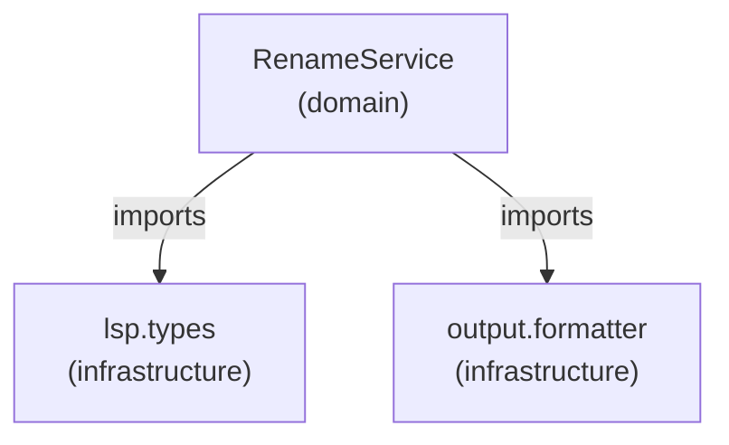
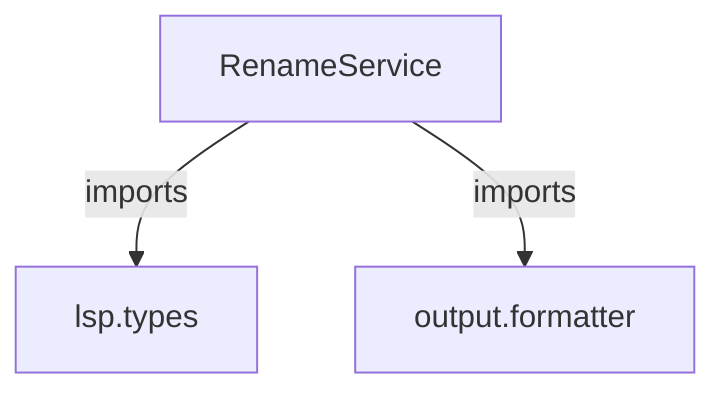
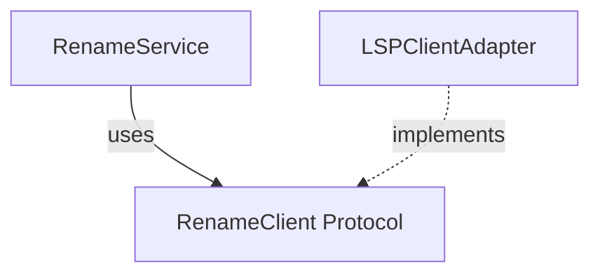

# Markdown Report Format

The architectural review is also writable as a structured markdown file. The frontmatter carries **configuration** (glossary, legend, enums, statistics) while the body carries **candidates** (overview table + detailed sections) and **prose/diagrams**. A script can derive the full HTML report from this markdown deterministically: frontmatter maps to HTML metadata/legend, body overview table maps to card index, body sections map to card content, Mermaid blocks render as-is.

## Why markdown alongside HTML

- **Versionable:** md lives in git; HTML is generated
- **Scriptable:** frontmatter is parseable YAML; body is structured markdown
- **Portable:** renders in Obsidian, GitHub, any markdown viewer
- **Separation of concerns:** data (frontmatter) vs presentation (HTML template)

## Frontmatter schema

The frontmatter carries **configuration** (metadata, glossary, legend, enums, statistics). Candidates live in the body as an **overview table** followed by detailed sections. Every key maps to a specific HTML element.

```yaml
---
# ── Metadata ──────────────────────────────────────────────
title: Architecture Deepening Review
date: 2026-06-01                    # ISO date
project: llm-lsp-cli                # repo name
tags: [architecture, refactoring, module-depth]

# ── Review metadata (generated per review) ───────────────
repository: <org/repo>               # e.g. acme/platform
branch: <branch-name>                # e.g. feat/auth-refactor
reviewed: <ISO-datetime-with-tz>     # e.g. 2026-06-01T14:32:00+08:00
files_scanned: <int>                 # total files read during review
model: <model-name>                  # e.g. Claude Opus 4

# ── Glossary (maps to HTML legend) ──────────────────────
# Each key maps to a legend entry in the HTML header.
# The keys are FIXED — scripts use them for CSS class mapping.
glossary:
  module: anything with an interface and an implementation
  seam: where an interface lives; a place behaviour can be altered without editing in place
  leakage: dependency that crosses a seam in the wrong direction
  deep_module: high leverage — a lot of behaviour behind a small interface
  shallow_module: interface nearly as complex as the implementation
  deletion_test: delete the module; if complexity vanishes it was a pass-through
  locality: change, bugs, knowledge concentrated in one place
  leverage: what callers get from depth

# ── Legend (maps to HTML legend row) ─────────────────────
# Enumeration of visual symbols used in diagrams.
# Keys are FIXED — scripts map them to CSS classes.
legend:
  module: { symbol: "solid box", css: "border-slate-400" }
  seam: { symbol: "dashed line", css: "border-dashed border-slate-400" }
  leakage: { symbol: "red arrow", css: "border-red-500" }
  deep_module: { symbol: "thick dark box", css: "border-emerald-600 bg-emerald-50" }

# ── Strength enum (css class is the script contract) ─────
# The HTML template defines the actual colors — frontmatter
# only carries the class name so scripts can emit the right element.
strength_enum: &strength_enum
  Strong: { css: "badge-strong" }
  Worth exploring: { css: "badge-worth" }
  Speculative: { css: "badge-speculative" }

# ── Dependency category enum ────────────────────────────
category_enum: &category_enum
  in_process: { label: "in-process", description: "pure computation, no I/O" }
  local_substitutable: { label: "local-substitutable", description: "local test stand-ins exist" }
  ports_and_adapters: { label: "ports & adapters", description: "remote but owned services" }
  mock: { label: "mock", description: "true external, third-party" }

# ── Statistics (maps to summary section) ─────────────────
# Scripts use these for the "at a glance" table.
statistics:
  candidates: 6
  strong: [1, 2, 3]
  worth_exploring: [4, 5]
  speculative: [6]
  total_lines_reviewed: 7534
  files_involved: 18
---
```

**Note:** Candidates are NOT in frontmatter. They live in the body as an overview table (see below). This keeps frontmatter lean (~50 lines of config) and avoids duplicating prose that the body sections carry anyway.

## Body structure

The body has three layers: **overview**, **detailed cards**, and **top recommendation**.

### Overview section

A markdown table summarizing all candidates. Scripts parse this to generate the card index or summary table. The table columns are FIXED.

```markdown
## Overview

| # | Strength | Candidate | Files | Lines | Category |
|---|----------|-----------|-------|-------|----------|
| 1 | **Strong** | LSPClient Decomposition | 3 | 1,906 | in-process |
| 2 | **Strong** | Command Template Pattern | 2 | 1,791 | in-process |
| 3 | **Strong** | Domain-Infrastructure Boundary | 3 | 927 | ports & adapters |
| 4 | Worth exploring | Duplicate Overload Declarations | 3 | 290 | in-process |
| 5 | Worth exploring | Symbol Transformation Unification | 4 | 2,052 | in-process |
| 6 | Speculative | ConfigManager Facade Pruning | 2 | 568 | in-process |
```

### Detailed card sections

Each `## N. Title` becomes one `<article>`. The section carries **solution**, **wins**, diagrams, prose, and ADR callouts — everything the overview table can't express.

```markdown
## 1. LSPClient Decomposition

> [!badge]
> **Strong** · in-process

> [!files]
> - `lsp/client.py`
> - `lsp/transport.py`
> - `lsp/types.py`

> [!legend]
> shallow_module · leakage · locality

> [!problem]
> Two independent code paths for every LSP method; duplicate normalizers

**Solution:** Typed methods delegate to generic request(); single normalization authority

**Wins:**
- locality: normalization lives in one module
- leverage: one handler entry per new method
- ~200 lines deleted

### Before / After

> **BEFORE** — Two parallel paths

<Mermaid diagram here>

> **AFTER** — Single authority

<Mermaid diagram here>

### Details

<prose expanding on problem/solution — only when diagram needs context>

> [!warning] ADR note
> Completes ADR-0028 intent.
```

### Top recommendation section

A final `## Top Recommendation` section with prose rationale. Scripts can parse the first paragraph for primary/secondary candidate IDs.

```markdown
## Top Recommendation

**Tackle candidate #1 first.** Highest leverage-to-risk ratio...

**Second priority: candidate #2.** ...
```

## Diagram representation

### Mermaid (all diagrams)

All diagrams use Mermaid blocks. Mermaid renders in both markdown viewers and derived HTML. Use `graph TD` or `graph LR` for dependency graphs, `sequenceDiagram` for call flows, and so on.

````markdown

````

For before/after comparisons, use separate Mermaid blocks with markdown blockquote headers:

````markdown
> **BEFORE** — Domain depends on infrastructure



> **AFTER** — Domain owns protocols


````

## Element mapping: HTML to MD

| HTML Element | MD Location | Script Action |
|---|---|---|
| `<header>` legend row | `frontmatter.legend` | Render legend from YAML |
| `<header>` glossary | `frontmatter.glossary` | Render glossary from YAML |
| Review metadata (repo, branch, date) | `frontmatter.repository`, `.branch`, `.reviewed` | Render in report header |
| Files scanned | `frontmatter.files_scanned` | Render in summary |
| Model | `frontmatter.model` | Render in report header |
| Overview table | Body `## Overview` section | Parse table rows into card index |
| Badge (Strong/Worth/Spec) | Overview table "Strength" column | Map via `strength_enum` |
| Badge (category) | Overview table "Category" column | Map via `category_enum` |
| Badge row | Body `## N. Title` > `> [!badge]` callout | Render strength + category badges |
| Files list | Body `## N. Title` > `> [!files]` callout | Render as monospaced file list |
| Legend tags | Body `## N. Title` > `> [!legend]` callout | Render glossary term badges |
| Problem text | Body `## N. Title` > `> [!problem]` callout | Render in card header |
| Solution text | Body `## N. Title` > `**Solution:**` paragraph | Render in card |
| Wins bullets | Body `## N. Title` > `**Wins:**` list | Render as bullets |
| ADR callout | Body `> [!warning]` or `> [!note]` callout | Render amber/neutral box |
| Mermaid diagram | Body ` ```mermaid ``` ` block | Copy to HTML `<pre class="mermaid">` |
| Summary table | `frontmatter.statistics` | Render "at a glance" numbers |
| Top recommendation | Body `## Top Recommendation` | Render final card | |

## Frontmatter key types

| Key | Type | Values | Maps To |
|---|---|---|---|
| `strength_enum` | map | `Strong`, `Worth exploring`, `Speculative` | Badge CSS class |
| `category_enum` | map | `in_process`, `local_substitutable`, `ports_and_adapters`, `mock` | Badge labels |
| `statistics.candidates` | int | count | Summary table |
| `statistics.strong` | array of int | candidate IDs | Summary table filter |
| `statistics.worth_exploring` | array of int | candidate IDs | Summary table filter |
| `statistics.speculative` | array of int | candidate IDs | Summary table filter |
| `statistics.total_lines_reviewed` | int | total source lines | Summary table |
| `statistics.files_involved` | int | file count | Summary table |

## Validation rules

Scripts deriving HTML from this markdown should enforce:

1. Overview table rows must have 6 columns: `#`, `Strength`, `Candidate`, `Files`, `Lines`, `Category`
2. Every Strength value in the overview table must exist in `strength_enum`
3. Every Category value in the overview table must exist in `category_enum`
4. `## N. Title` headings must match overview table row `#` column (1-indexed)
5. Each `## N. Title` section must contain, in order: `> [!badge]` callout, `> [!files]` callout, `> [!legend]` callout, `> [!problem]` callout, `**Solution:**` paragraph, and `**Wins:**` list
6. `statistics.strong` + `statistics.worth_exploring` + `statistics.speculative` must cover all candidate IDs from the overview table
7. All diagrams MUST use Mermaid blocks — no prose-based or hand-built diagram representations
