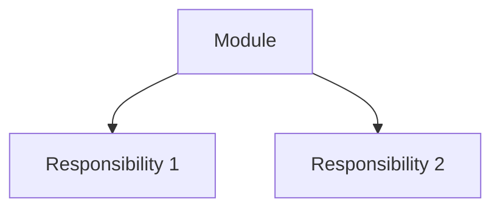
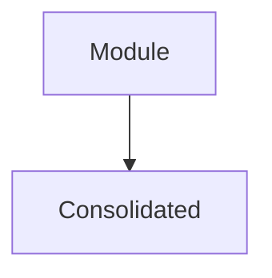

# md-to-html

Convert Markdown files into styled, human-readable HTML views using the "kami" design system (v2).

## Overview

This skill treats Markdown as the canonical source and HTML as a generated view. It bundles assets like CSS and Mermaid.js for performance and offline usage.

## Features (v2)

- **Multi-Flavor Design Systems**: Support for multiple design systems (flavors) including `kami` and `minimal`. Any system from [nexu-io/open-design](https://github.com/nexu-io/open-design) can be added.
- **Dynamic Skinning**: Automatically skins the report layout by injecting design tokens from the selected flavor's `tokens.css`.
- **Enhanced Kami Layout**: A robust, responsive report layout that automatically applies `md-{element}` classes and handles tabular alignment for numeric data.
- **Section & Card Synthesis**: Numeric H2s and "Problem/Solution/Wins" patterns are transformed into styled `.md-section` and `.md-card` blocks.
- **Detail Grid Synthesis**: Groups core deepening opportunity elements into a responsive 3-column `md-detail-grid`.
- **Mermaid.js Support**: Renders diagrams using bundled Mermaid.js (v11) referenced from skill assets.

## Usage

```bash
uv run python3 skills/md-to-html/scripts/render.py <source.md> [-o output.html] [-f <flavor>] [--inline]
```

### Arguments

- `source`: Path to the source Markdown file.
- `-o, --output`: Optional output path (defaults to same name as source).
- `-f, --flavor`: Design system flavor (default: `kami`). Supported: `kami`, `minimal`.
- `--inline`: Embed Mermaid.js directly into the HTML (CSS is always inlined for flavor portability).

## Element Mappings

| Markdown Element | HTML Element | Kami Class / Wrapper |
| :--- | :--- | :--- |
| Document Root | `<body>` | `<article class="md-document">` |
| Frontmatter: `project` | `<h1>` | `class="md-heading-level-1"` (Inside `.md-header`) |
| Frontmatter: `metadata`| `<div>` | Render repo, branch, reviewed, model in header |
| Frontmatter: `glossary`| `<dl>` | Render glossary from YAML at bottom |
| Frontmatter: `statistics`| `<div>` | `class="md-meta"` / `.md-meta-item` |
| H1 (`#`) | `<h1>` | `class="md-heading-level-1"` |
| H2 (`## N. Title`) | `<section>` | `class="md-section"` with `.md-section-num` |
| H3 (`###`) | `<div>` | `class="md-card"` with `.md-card-header` |
| Pattern: Problem/Sol/Wins| `<div>` | `class="md-detail-grid"` with 3 cols |
| Table Cell (Numeric) | `<td>` | `class="md-tabular"` |
| Mermaid Block | `<div>` | `class="mermaid"` |

## Assets & Flavors

- **Common Assets**: `skills/md-to-html/assets/mermaid.min.js`.
- **Flavors**: Stored in `skills/md-to-html/flavors/`. Each contains a `style.css` (base) or `reference/tokens.css` (tokens).

## Script-Friendly Markdown Patterns

These patterns teach other skills how to write markdown that a script can deterministically convert to HTML. The core idea: **frontmatter carries data, callouts carry structured elements, Mermaid carries diagrams**.

### 1. Callout-as-data-carrier

Use Obsidian `> [!TYPE]` callouts as machine-parseable markers for structured elements that don't have native markdown equivalents. The script detects `[!TYPE]`, extracts the body, and routes it to the corresponding HTML renderer.

**Supported callout types:**

| Callout | Purpose | Body format | HTML output |
|---------|---------|-------------|-------------|
| `> [!badge]` | Classification tags | `**Strong** · in-process` | Badge row with colored spans |
| `> [!files]` | Related files | `- \`path/file.py\`` | Monospaced file list |
| `> [!legend]` | Glossary term tags | `leakage · seam · locality` | Term badges |
| `> [!problem]` | Problem statement | Free text | Styled blockquote |

**Why callouts over bold text:** `> **Problem:** text` is prose that requires regex to extract. `> [!problem]\n> text` is a structured token the script can split on reliably. The callout type is the routing key; the body is the payload.

**Pattern for adding new callouts:**
1. Pick a type name: `[!typename]`
2. Define the body format (one-line, list, or free text)
3. Add the type to the script's regex: `r'\[!(badge|files|legend|problem|typename)\]'`
4. Add the renderer branch in the callout handler

### 2. Frontmatter separation

Frontmatter is **data**, not presentation. The HTML template owns colors, spacing, and layout.

**Rules:**
- `css` class names belong in frontmatter (they're the script contract)
- Color tokens (`emerald`, `amber`) belong in the stylesheet (they're design decisions)
- Enum values are semantic (`Strong`, `Worth exploring`) — the template maps them to CSS

**Example — strength enum:**
```yaml
# Correct: css class is the contract
strength_enum:
  Strong: { css: "badge-strong" }

# Wrong: color token leaks design into data
strength_enum:
  Strong: { color: emerald, css: "badge-strong" }
```

### 3. Mermaid-only diagrams

All diagrams use ```` ```mermaid ``` ```` blocks. No hand-built prose, no `<!-- diagram: TYPE -->` comments, no mixed rendering strategies.

**Why:** A single rendering pipeline (parse Mermaid block → copy to `<pre class="mermaid">`) eliminates ambiguity. The script doesn't need to detect diagram types or switch between renderers.

**Before/after pattern:**
```markdown
> **BEFORE** — Description of current state



> **AFTER** — Description of proposed state


```

### 4. Card section order

When a markdown file represents a list of items (candidates, issues, features), each item follows a fixed order that mirrors its HTML rendering:

```
## N. Title                    → <section> with <h2>

> [!badge]                    → badge row
> **Strong** · category

> [!files]                    → file list
> - `path/file.py`

> [!legend]                   → term tags
> term1 · term2 · term3

> [!problem]                  → problem statement
> Description text.

**Solution:** What changes.    → plain bold paragraph
**Wins:**                      → plain bold paragraph
- glossary-term: the gain      → bullet list

### Before / After             → Mermaid diagrams
```

**Why this order:** Badge and metadata come first (scanning), then the problem (context), then the solution and wins (action), then diagrams (evidence). This matches how humans read: "what is this?" → "what's wrong?" → "what should change?" → "show me."

### 5. Enum pattern

Frontmatter enums carry semantic values with optional css class hints. The HTML template maps these to visual styles.

```yaml
strength_enum:          # keys are semantic values
  Strong: { css: "badge-strong" }
  Worth exploring: { css: "badge-worth" }

category_enum:          # keys are identifiers, values have label + description
  in_process: { label: "in-process", description: "pure computation, no I/O" }

glossary:               # keys are terms, values are definitions
  module: anything with an interface and an implementation
  seam: where an interface lives

legend:                 # keys are visual symbols, css describes appearance
  module: { symbol: "solid box", css: "border-slate-400" }
  leakage: { symbol: "red arrow", css: "border-red-500" }
```

**Distinction:** `legend.css` describes diagram symbols (intrinsic to meaning). `strength_enum.css` describes badge styling (presentation). Both are css class contracts, but legend ties to visual semantics while strength ties to chrome.

### 6. Review metadata

Frontmatter can carry generation metadata. This is data about the review itself, not the content.

```yaml
# ── Review metadata (generated per review) ───────────────
repository: <org/repo>
branch: <branch-name>
reviewed: <ISO-datetime-with-tz>
files_scanned: <int>
model: <model-name>
```

The script renders these in the report header. Template placeholders (`<org/repo>`) in specs, concrete values in actual reviews.

