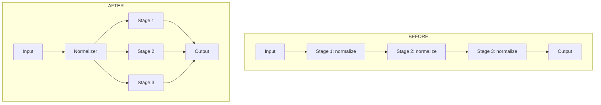
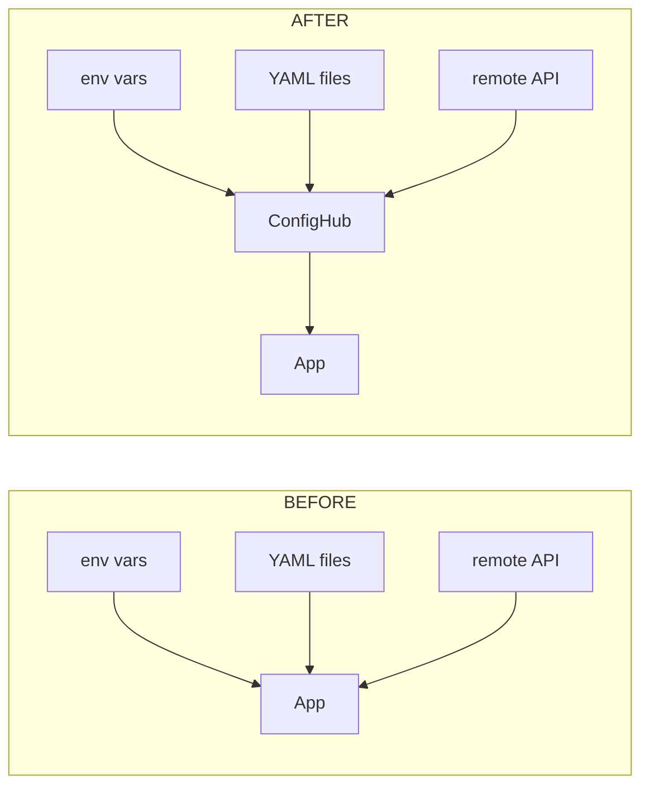
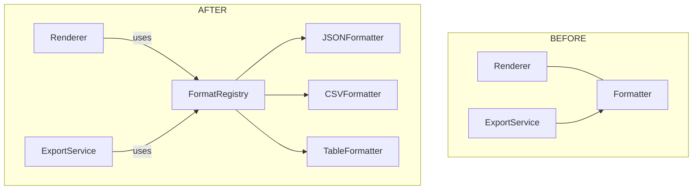

## Overview

| # | Strength | Candidate | Files | Lines | Category |
|---|----------|-----------|-------|-------|----------|
| 1 | **Strong** | Pipeline Normalization | 5 | 1,206 | in-process |
| 2 | **Strong** | Config Unification | 3 | 500 | ports & adapters |
| 3 | **Worth exploring** | Output Formatter Extraction | 3 | 200 | local-substitutable |

## 1. Pipeline Normalization

> [!badge]
> Strong · in-process

> [!files]
> - `domain/pipeline/normalizer.py`
> - `domain/pipeline/validator.py`
> - `domain/pipeline/transformer.py`
> - `domain/models.py`
> - `output/renderer.py`

> [!legend]
> deep_module · seam · leakage

> [!problem]
> Pipeline stages each duplicate normalization logic. Three independent code paths for input validation, type coercion, and field mapping produce inconsistent results when processing the same input through different stages.

> [!warning]
> Contradicts ADR-0019 which specified per-stage validation. Must update ADR before merging.

> [!note]
> First phase of a larger pipeline refactor. This candidate is the highest-leverage because it fixes the root cause rather than patching symptoms.

### Before / After



**Solution:** Extract a single `Normalizer` class that all pipeline stages delegate to. Each stage calls `normalizer.process(data)` instead of maintaining its own validation and coercion.

**Wins:**
- locality: normalization lives in one module, not three
- leverage: every pipeline stage benefits from the fix
- seam: Normalizer becomes the interface between input and processing
- deep_module: Normalizer is substantially simpler than the sum of three per-stage implementations

### Details

The `Normalizer` class handles three concerns currently duplicated across stages:

1. **Type coercion** — string-to-int, date parsing, enum mapping
2. **Field validation** — required field presence, range checks, format validation
3. **Default application** — config-driven defaults for optional fields

Each stage currently imports `domain.models` and applies these checks independently. The Normalizer consolidates all three into a single call site with consistent error reporting.

```python
class Normalizer:
    """Single authority for input normalization."""
    def process(self, data: dict) -> NormalizedInput:
        coerced = self._coerce_types(data)
        self._validate(coerced)
        return NormalizedInput(**coerced)
```

## 2. Config Unification

> [!badge]
> Strong · ports & adapters

> [!files]
> - `config/loader.py`
> - `config/remote_fetcher.py`
> - `domain/services/config_service.py`

> [!legend]
> seam · shallow_module

> [!problem]
> Configuration is loaded from three sources (env vars, YAML files, remote API) with no unified interface. The remote fetcher has its own caching layer that duplicates logic from the local YAML loader.

> [!note]
> The remote config API is an owned service — not third-party. Use the ports & adapters pattern rather than mocking.

### Before / After



**Solution:** Create a `ConfigHub` class that implements the ports & adapters pattern. Each config source becomes an adapter behind a shared interface. The app queries `ConfigHub` and never touches individual loaders.

**Wins:**
- seam: ConfigHub is the single interface for all config
- locality: caching lives in one place, not duplicated per source
- leverage: adding a new config source requires one new adapter, zero app changes

## 3. Output Formatter Extraction

> [!badge]
> Worth exploring · local-substitutable

> [!files]
> - `output/formatter.py`
> - `output/renderer.py`
> - `domain/services/export_service.py`

> [!legend]
> shallow_module · leakage

> [!problem]
> The output formatter is tangled with the renderer — changing output format (JSON, CSV, table) requires modifying renderer internals. The export service directly imports formatter internals.

### Before / After



**Solution:** Extract formatters behind a `FormatRegistry` interface. The renderer and export service both query the registry by format name. Each formatter is a separate module implementing the same protocol.

**Wins:**
- seam: FormatRegistry is the interface between consumers and formatters
- locality: each formatter is a self-contained module
- deep_module: FormatRegistry interface is a single `format(data, fmt)` call

> [!warning]
> Worth exploring rather than Strong because the current formatter/renderer coupling affects only the export path, not the main pipeline. Weigh this against the Pipeline Normalization candidate which affects every input.

## Top Recommendation

Primary choice is candidate 1 (Pipeline Normalization). Candidate 2 (Config Unification) should follow in the same sprint since it shares no code with candidate 1 and can run in parallel. Candidate 3 (Output Formatter Extraction) should wait — it is lower leverage and its `[!warning]` note should be addressed in planning before scheduling.
