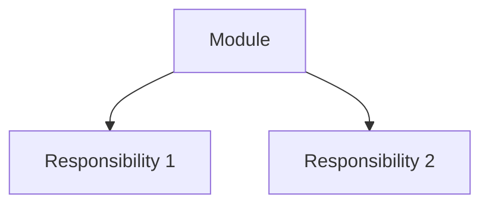
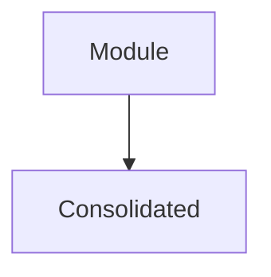

# Authoring Guide: Writing Script-Friendly Markdown

How to write markdown that `render.py` deterministically converts to styled HTML. This guide is the contract — every pattern documented here is guaranteed by the implementation.

## Core Principle

**Frontmatter carries data. Callouts carry structured elements. Mermaid carries diagrams.**

When a `.md` file is primarily for LLM consumption, write normal markdown. When it also needs to render as curated HTML, add these three mechanisms. They're the only things the script looks for — everything else passes through as standard markdown.

## 1. Callout-as-Data-Carrier

Use Obsidian `> [!TYPE]` callouts as machine-parseable markers for structured elements that have no native markdown equivalent. The script detects `[!TYPE]`, extracts the body, and routes it to the corresponding HTML renderer.

**The [Callouts Manifest](flavors/callouts-manifest.md) is the authoritative source for callout types.** The summary below gives you enough to start writing; the manifest has full semantics, HTML output specs, and the flavor implementer checklist.

### Supported Callout Types (Quick Reference)

| Callout | Purpose | Body format | Semantic |
|---------|---------|-------------|----------|
| `> [!badge]` | Classification tags | `Strong · in-process` | "What kind of recommendation is this?" |
| `> [!files]` | Related file paths | `- \`path/file.py\`` | "Which files would I need to touch?" |
| `> [!legend]` | Glossary term tags | `leakage · seam · locality` | "Which glossary concepts apply here?" |
| `> [!problem]` | Problem statement | Free text | "What is wrong with the current state?" |
| `> [!warning]` | Warning/ADR conflict | Free text | "What should I be careful about?" |
| `> [!note]` | Neutral annotation | Free text | "What else should I know?" |

### Adding New Callouts

The process for adding callout types lives in the [Callouts Manifest](flavors/callouts-manifest.md) under "Adding a new callout type." Do not add types without updating the manifest — it is the single source of truth that keeps the renderer, CSS, validator, and authoring guide in sync.

### Callout Order

Within a card section, callouts must appear in this order:

```
> [!badge]       ← classification (strength + category)
> [!files]       ← involved files
> [!legend]      ← glossary term tags
> [!problem]     ← problem statement
```

`[!warning]` and `[!note]` can appear anywhere after the core four, typically before or after diagrams.

### Why Callouts Over Bold Text

`> **Problem:** text` is prose that requires fragile regex to extract. `> [!problem]\n> text` is a structured token the script splits on reliably. The callout type is the routing key; the body is the payload.

## 2. Frontmatter Schema

Frontmatter splits into two categories: **functional elements** (drive rendering logic) and **common message** (informational metadata displayed as overview). The HTML template owns colors, spacing, and layout — frontmatter carries only data and CSS class contracts.

### Functional Elements

These keys drive HTML generation logic:

| Key | Type | Purpose |
|-----|------|---------|
| `title` | string | Document title (eyebrow in header) |
| `project` | string | Project name (h1 in header) |
| `statistics` | object | Summary numbers — rendered as a card dashboard at the top of the header |
| `strength_enum` | map | Badge CSS mapping — also renders as visible tag legend in the enum bar |
| `category_enum` | map | Category badge labels — also renders as visible tag legend in the enum bar |
| `legend` | map | Diagram symbol legend with CSS classes — swatches in header |
| `glossary` | map | Term definitions rendered as a dedicated section at page bottom |

**`statistics` keys:**
```yaml
statistics:
  candidates: 24              # → total group card
  strong: 7                   # → strength group card (uses strength_enum.css)
  worth_exploring: 12         # → strength group card (uses strength_enum.css)
  speculative: 5              # → strength group card (uses strength_enum.css)
  total_lines_reviewed: 1906  # → effort group card
  files_involved: 3           # → effort group card
```
Strength cards (strong, worth_exploring, speculative) automatically inherit their accent color from `strength_enum.css` — no extra configuration needed.

### Common Message

These keys are displayed in the header meta section as label-value pairs. They can also be a `{ value, css }` dict for optional styling:

| Key | Display label | Example value |
|-----|---------------|---------------|
| `repository` | Repository | `acme/platform` or `{ value: "acme/platform", css: "md-tag-muted" }` |
| `branch` | Branch | `feat/auth-refactor` |
| `reviewed` | Reviewed | `2026-06-01T14:32:00+08:00` |
| `files_scanned` | Files scanned | `24` |
| `model` | Model | `Claude Opus 4` |
| `date` | Reviewed (fallback) | `2026-06-01` |

`reviewed` is preferred over `date` for the review timestamp. If `reviewed` is absent, `date` is used as fallback.

### CSS Class Contract

Enum values carry `css` class names — these are the script contract. Color tokens belong in the stylesheet, not in frontmatter.

```yaml
# Correct: css class is the contract
strength_enum:
  Strong: { css: "badge-strong" }
  Worth exploring: { css: "badge-worth" }
  Speculative: { css: "badge-speculative" }

# Wrong: color token leaks design into data
strength_enum:
  Strong: { color: emerald, css: "badge-strong" }
```

### Overview Table Enum Coloring

When an overview table has a "Strength" or "Category" column, each cell's text is wrapped in `<span class="md-tag {enum.css}">` using the matching `strength_enum` or `category_enum` entry. This keeps table styling consistent with badge rendering.

```markdown
| # | Strength | Candidate | Files | Lines | Category |
|---|----------|-----------|-------|-------|----------|
| 1 | **Strong** | Title | 3 | 1,906 | in-process |
```

The **Strong** and **in-process** cells get color-coded tags automatically.

## 3. Card Section Order

When a markdown file represents a list of candidates, each follows a fixed order that mirrors the HTML rendering:

```
## N. Title                          → <section> with <h2>

> [!badge]                          → badge row (strength + category)
> **Strong** · category

> [!files]                          → file list (monospaced, · separated)
> - `path/file.py`

> [!legend]                         → term tags (swatch badges)
> term1 · term2 · term3

> [!problem]                        → problem statement (styled blockquote)
> Description text.

**Solution:** What changes.           → plain bold paragraph (standard markdown)

**Wins:**                            → plain bold paragraph + bullet list
- glossary-term: the gain            → (standard markdown)

### Before / After                   → Mermaid diagrams
```

**Why this order:** Badge and metadata come first (scanning), then the problem (context), then the solution and wins (action), then diagrams (evidence). This matches how humans read: "what is this?" → "what's wrong?" → "what should change?" → "show me."

**Solution and Wins are standard markdown.** The script does not synthesize them into a special layout. They render as bold paragraphs with bullet lists — clean, readable, and sufficient.

## 4. Enum Pattern

Frontmatter enums carry semantic values with `css` class hints. The HTML template maps these to visual styles.

```yaml
strength_enum:          # keys are semantic values
  Strong: { css: "badge-strong" }
  Worth exploring: { css: "badge-worth" }
  Speculative: { css: "badge-speculative" }

category_enum:          # keys are identifiers, values have label + description
  in_process: { label: "in-process", description: "pure computation, no I/O" }
  local_substitutable: { label: "local-substitutable", description: "local test stand-ins exist" }
  ports_and_adapters: { label: "ports & adapters", description: "remote but owned services" }
  mock: { label: "mock", description: "true external, third-party" }

glossary:               # keys are terms, values are definitions
  module: anything with an interface and an implementation
  seam: where an interface lives

legend:                 # keys are visual symbols, css describes appearance
  module: { symbol: "solid box", css: "border-slate-400" }
  leakage: { symbol: "red arrow", css: "border-red-500" }
```

**Distinction:** `legend.css` describes diagram symbols (intrinsic to meaning). `strength_enum.css` describes badge styling (presentation/chrome). Both are css class contracts, but legend ties to visual semantics while strength ties to chrome.

## 5. Mermaid-Only Diagrams

All diagrams use ```` ```mermaid ``` ```` blocks. A single rendering pipeline: parse Mermaid block → copy to `<pre class="mermaid">`. No hand-built prose, no HTML comments, no mixed rendering strategies.

### Before/After Pattern

```markdown
> **BEFORE** — Description of current state



> **AFTER** — Description of proposed state


```

Use `graph TD` or `graph LR` for dependency graphs, `sequenceDiagram` for call flows.

## 6. Overview Table

A markdown table summarizing all candidates. Six fixed columns:

```markdown
## Overview

| # | Strength | Candidate | Files | Lines | Category |
|---|----------|-----------|-------|-------|----------|
| 1 | **Strong** | Title Here | 3 | 1,906 | in-process |
```

The script adds `md-tabular` class to numeric cells for alignment. Column values in the `Strength` and `Category` columns should match keys (or labels) from `strength_enum` and `category_enum`.

## 7. What Passes Through

These elements receive standard markdown rendering with class mappings (`md-paragraph`, `md-list`, `md-list-item`, etc.) — no special synthesis:

- `**Solution:**` paragraphs
- `**Wins:**` bullet lists
- `### Details` subsections
- Top Recommendation section
- Any prose between callouts and diagrams

They don't need special handling. The standard markdown renderer produces clean, readable HTML with the kami flavor's typography.
