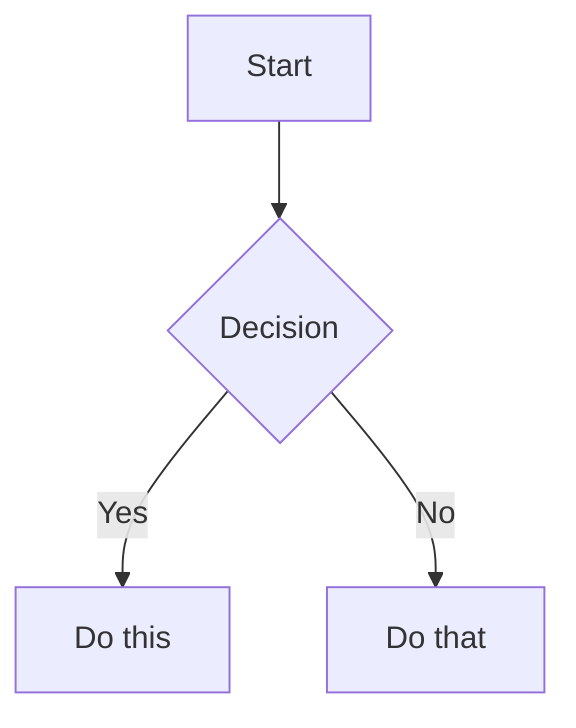

# Obsidian Flavored Markdown

Reference for Obsidian-specific markdown extensions. Standard Markdown (headings, bold, italic, lists, quotes, code blocks, tables) is assumed knowledge.

## Wikilinks

```markdown
[[Note Name]]                          Link to note
[[Note Name|Display Text]]             Custom display text
[[Note Name#Heading]]                  Link to heading
[[#Heading in same note]]              Same-note heading link
```

Use `[[wikilinks]]` for notes within the vault (Obsidian tracks renames automatically) and `[text](url)` for external URLs only.

### Prefer Heading Links Over Block IDs

**Avoid block IDs** (`^block-id`) — they are fragile and hard to maintain:
- Content changes can break cross-file references
- Inserting/removing paragraphs invalidates IDs
- No reliable way to generate stable, meaningful IDs

**Instead, use heading links:**
```markdown
[[Note Name#Section]]                  Link to section (stable, auto-tracked)
[[#Section in same note]]              Same-note section link
```

Headings are stable, meaningful, and Obsidian automatically tracks renames. Only use block IDs when you have a specific, rare need to reference a single paragraph — and even then, consider restructuring the content with a heading instead.

## Embeds

Prefix any wikilink with `!` to embed content inline:

```markdown
![[Note Name]]                         Embed full note
![[Note Name#Heading]]                 Embed section
![[image.png]]                         Embed image
![[image.png|300]]                     Embed image with width
![[document.pdf#page=3]]               Embed PDF page
```

See [$SKILL_DIR/references/EMBEDS.md]($SKILL_DIR/references/EMBEDS.md) for audio, video, search embeds, and external images.

## Callouts

```markdown
> [!note]
> Basic callout.

> [!warning] Custom Title
> Callout with a custom title.

> [!faq]- Collapsed by default
> Foldable callout (- collapsed, + expanded).
```

Common types: `note`, `tip`, `warning`, `info`, `example`, `quote`, `bug`, `danger`, `success`, `failure`, `question`, `abstract`, `todo`.

See [$SKILL_DIR/references/CALLOUTS.md]($SKILL_DIR/references/CALLOUTS.md) for the full list with aliases, nesting, and custom CSS callouts.

## Properties (Frontmatter)

```yaml
---
title: My Note
date: 2024-01-15
tags:
  - project
  - active
aliases:
  - Alternative Name
cssclasses:
  - custom-class
---
```

Default properties: `tags` (searchable labels), `aliases` (alternative note names for link suggestions), `cssclasses` (CSS classes for styling).

See [$SKILL_DIR/references/PROPERTIES.md]($SKILL_DIR/references/PROPERTIES.md) for all property types, tag syntax rules, and advanced usage.

## Tags

```markdown
#tag                    Inline tag
#nested/tag             Nested tag with hierarchy
```

Tags can contain letters, numbers (not first character), underscores, hyphens, and forward slashes. Tags can also be defined in frontmatter under the `tags` property.

## Comments

```markdown
This is visible %%but this is hidden%% text.

%%
This entire block is hidden in reading view.
%%
```

## Highlight

```markdown
==Highlighted text==                   Highlight syntax
```

## Math (LaTeX)

```markdown
Inline: $e^{i\pi} + 1 = 0$

Block:
$$
\frac{a}{b} = c
$$
```

## Diagrams (Mermaid)

````markdown

````

To link Mermaid nodes to Obsidian notes, add `class NodeName internal-link;`.

## Footnotes

```markdown
Text with a footnote[^1].

[^1]: Footnote content.

Inline footnote.^[This is inline.]
```
